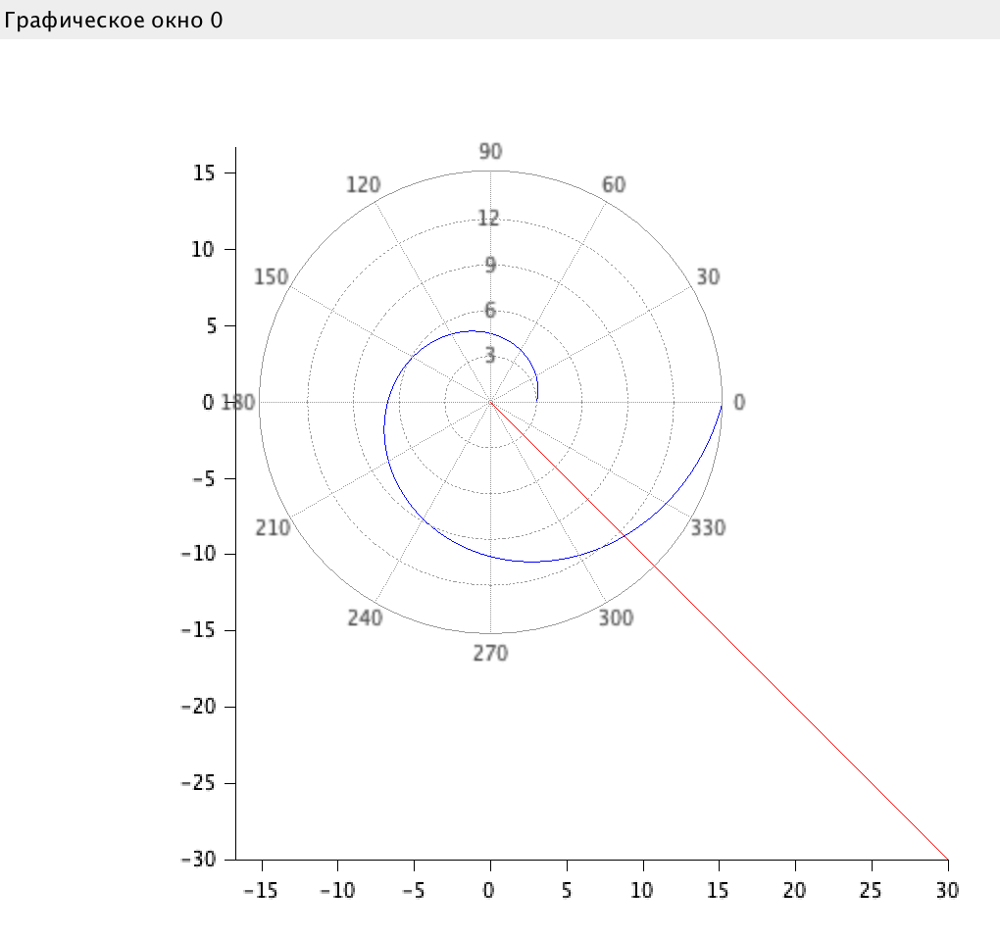
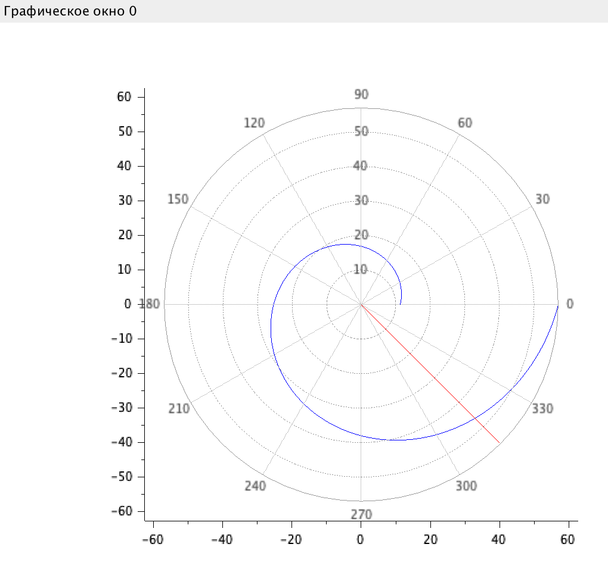
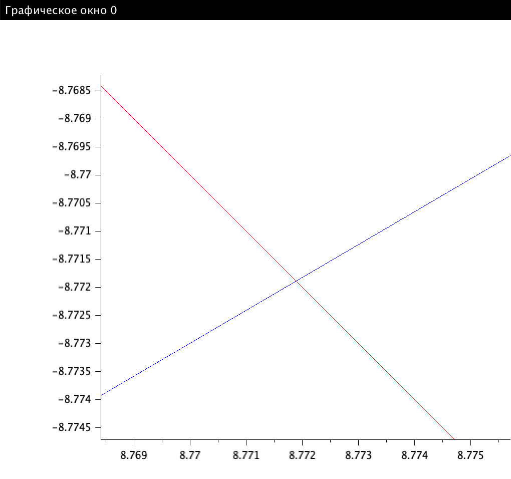
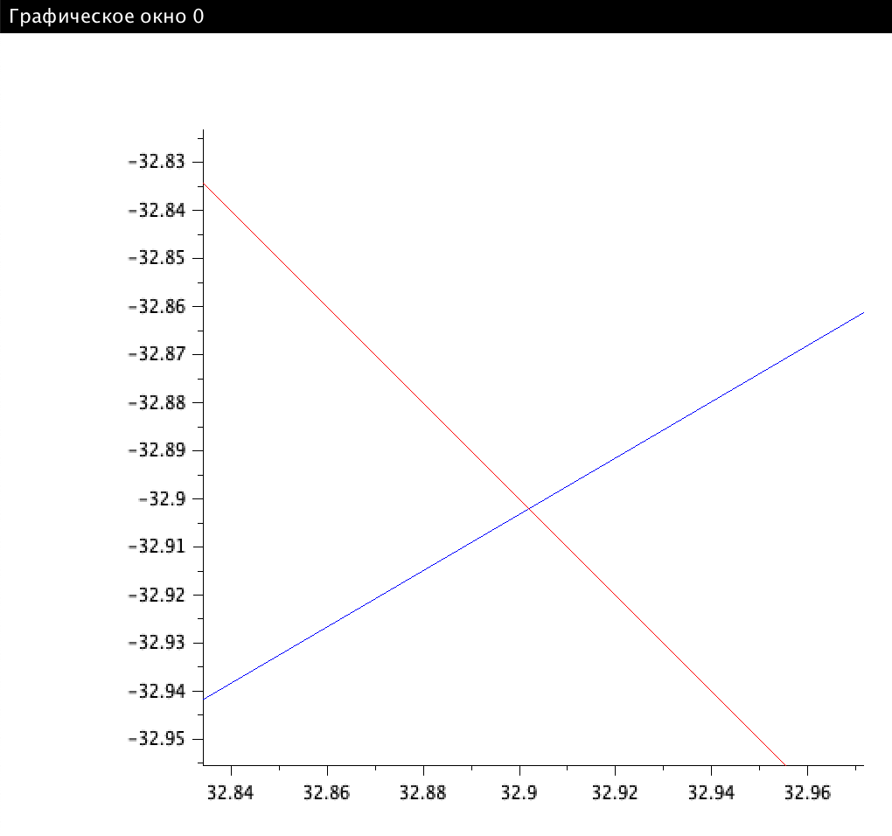

---
# Front matter
lang: ru-RU
title: Защита лабораторной работы №2. Задача о погоне
author: "Смородова Дарья Владимировна"
group: NFIbd-03-19
institute: RUDN University, Moscow, Russian Federation
date: 2022 Feb 19th

# Formatting
toc: false
slide_level: 2
theme: metropolis
header-includes: 
 - \metroset{progressbar=frametitle,sectionpage=progressbar,numbering=fraction}
 - '\makeatletter'
 - '\beamer@ignorenonframefalse'
 - '\makeatother'
aspectratio: 43
section-titles: true

---

# Цель выполнения лабораторной работы 

Целью данной работы является построение математической модели для выбора правильной стратегии при решении задач поиска на примере задачи о преследовании браконьеров береговой охраной.

# Задачи выполнения лабораторной работы

1. Провести рассуждения и вывод дифференциальных уравнений, описывающих движение катера, с начальными условиями для двух случаев (в зависимости от расположения катера относительно лодки в начальный момент времени);

2. Построить траекторию движения катера и лодки для двух случаев;

3. Определить по графику точку пересечения катера и лодки.

# Теоретические данные 

## Основное уравнение задачи

$$\frac{dr}{d\theta} = \frac{r}{\sqrt(15)} $$

## Начальные условия для первого случая: 
$$\left\{ 
\begin{array}{c}
\theta = 0 \\ 
r = \frac{15}{5} \\ 
\end{array}
\right.$$

## Начальные условия для второго случая: 
$$ \left\{ 
\begin{array}{c}
\theta = -\pi \\ 
r = \frac{15}{3} \\
\end{array}
\right.$$

## Тангенциальная скорость
$$v_t = \sqrt(4^2 * v^2 - v^2) = \sqrt(15) * v$$

# Результат выполнения лабораторной работы

## График для первого случая

## График для второго случая

## Точка пересечения в случае 1

## Точка пересечения в случае 1

# Выводы

- Построили математическую модель для решения задачи о погоне на примере задачи приследование браконьеров береговой охраной;

- Вывели дифференциальные уравнения, необходимые для решения данной задачи;

- Построили график для определения траекторий движения лодки и катера в двух случаях;

- Определили точку пересечения траекторий для двух случаев.