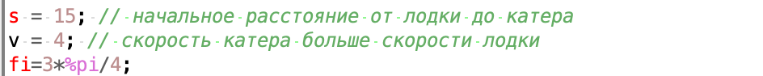

---
# Front matter
title: "Лабораторная работа №2. Задача о погоне"
subtitle: "Вариант 28"
author: "Смородова Дарья Владимировна"
group: NFIbd-03-19
institute: RUDN University, Moscow, Russian Federation
date: 2022 Feb 19th

# Generic otions
lang: ru-RU
toc-title: "Содержание"

# Bibliography
bibliography: bib/cite.bib
csl: pandoc/csl/gost-r-7-0-5-2008-numeric.csl

# Pdf output format
toc: true # Table of contents
toc_depth: 2
lof: true # List of figures
lot: true # List of tables
fontsize: 12pt
linestretch: 1.5
papersize: a4
documentclass: scrreprt
## I18n
polyglossia-lang:
  name: russian
  options:
	- spelling=modern
	- babelshorthands=true
polyglossia-otherlangs:
  name: english
### Fonts
mainfont: PT Serif
romanfont: PT Serif
sansfont: PT Sans
monofont: PT Mono
mainfontoptions: Ligatures=TeX
romanfontoptions: Ligatures=TeX
sansfontoptions: Ligatures=TeX,Scale=MatchLowercase
monofontoptions: Scale=MatchLowercase,Scale=0.9
## Biblatex
biblatex: true
biblio-style: "gost-numeric"
biblatexoptions:
  - parentracker=true
  - backend=biber
  - hyperref=auto
  - language=auto
  - autolang=other*
  - citestyle=gost-numeric
## Misc options
indent: true
header-includes:
  - \linepenalty=10 # the penalty added to the badness of each line within a paragraph (no associated penalty node) Increasing the value makes tex try to have fewer lines in the paragraph.
  - \interlinepenalty=0 # value of the penalty (node) added after each line of a paragraph.
  - \hyphenpenalty=50 # the penalty for line breaking at an automatically inserted hyphen
  - \exhyphenpenalty=50 # the penalty for line breaking at an explicit hyphen
  - \binoppenalty=700 # the penalty for breaking a line at a binary operator
  - \relpenalty=500 # the penalty for breaking a line at a relation
  - \clubpenalty=150 # extra penalty for breaking after first line of a paragraph
  - \widowpenalty=150 # extra penalty for breaking before last line of a paragraph
  - \displaywidowpenalty=50 # extra penalty for breaking before last line before a display math
  - \brokenpenalty=100 # extra penalty for page breaking after a hyphenated line
  - \predisplaypenalty=10000 # penalty for breaking before a display
  - \postdisplaypenalty=0 # penalty for breaking after a display
  - \floatingpenalty = 20000 # penalty for splitting an insertion (can only be split footnote in standard LaTeX)
  - \raggedbottom # or \flushbottom
  - \usepackage{float} # keep figures where there are in the text
  - \floatplacement{figure}{H} # keep figures where there are in the text
---

# Цель работы

Целью данной работы является построение математической модели для выбора правильной стратегии при решении задач поиска на примере задачи о преследовании браконьеров береговой охраной.

# Задание

На море в тумане катер береговой охраны преследует лодку браконьеров.
Через определенный промежуток времени туман рассеивается, и лодка
обнаруживается на расстоянии 15 км от катера. Затем лодка снова скрывается в тумане и уходит прямолинейно в неизвестном направлении. Известно, что скорость катера в 4 раза больше скорости браконьерской лодки.

1. Запишите уравнение, описывающее движение катера, с начальными
условиями для двух случаев (в зависимости от расположения катера
относительно лодки в начальный момент времени).

2. Постройте траекторию движения катера и лодки для двух случаев.

3. Найдите точку пересечения траектории катера и лодки. 

# Теоретическое введение

1. Примем за $t_0 = 0$, $x_{l0} = 0$ - место нахождения лодки браконьеров в момент обнаружения, $x_{k0} = k$ - место нахождения катера береговой охраны относительно лодки браконьеров в момент обнаружения лодки.

2. Введем полярные координаты. Считаем, что полюс - это точка обнаружения лодки браконьеров $x_{l0} (\theta = x_{l0} = 0)$ а полярная ось $r$ проходит через точку нахождения катера береговой охраны.

3. Траектория катера должна быть такой, чтобы и катер, и лодка все время были на одном расстоянии от полюса $\theta$, только в этом случае траектория катера пересечется с траекторией лодки.

    Поэтому для начала катер береговой охраны должен двигаться некоторое время прямолинейно, пока не окажется на том же расстоянии от полюса, что и лодка браконьеров. После этого катер береговой охраны должен двигаться вокруг полюса удаляясь от него с той же скоростью, что и лодка браконьеров.

4. Чтобы найти расстояние $x$ (расстояние после которого катер начнет двигаться вокруг полюса), необходимо составить простое уравнение. Пусть через время $t$ катер и лодка окажутся на одном расстоянии *x* от полюса. За это время лодка пройдет $x$, а катер $k-x$ (или $k+x$ в зависимости от начального положения катера относительно полюса). Время, за которое они пройдут это расстояние, вычисляется как $x/v$ или $k-x/nv$ (во втором случае $x+k/nv$). Так как время одно и то же, то эти величины одинаковы. [1]
    Тогда неизвестное расстояние $x$ можно найти из следующего уравнения:

    В первом случае:
    $$\frac{x}{v} = \frac{k-x}{nv}$$

    Во втором случае:
    $$\frac{x}{v} = \frac{x+k}{nv},$$

    где $n$ - во сколько раз скорость катера больше скорости лодки.

5. После того, как катер береговой охраны окажется на одном расстоянии от полюса, что и лодка, он должен сменить прямолинейную траекторию и начать двигаться вокруг полюса удаляясь от него со скоростью лодки $v$. Для этого скорость катера раскладываем на две составляющие: $v_r$ - радиальная скорость и $v_{/tao}$ - тангенциальная скорость.
    Радиальная скорость - это скорость, с которой катер удаляется от полюса. Нам нужно, чтобы эта скорость была равна скорости лодки. Тангенциальная скорость – это линейная скорость вращения катера относительно полюса. Она равна произведению угловой скорости на радиус.

    Учитывая, что радиальная скорость равна $v$, то получим следующую формулу для тангенциальной скорости:
    $$\ {v_t} = \sqrt(n^2*v^2-v^2)$$

    где $n$ - во сколько раз скорость катера больше скорости лодки.

6. Решение задачи сводится к решению системы из двух дифференциальных уравнений:
    $$\left\{ 
    \begin{array}{c}
    \frac{dr}{dt} = v \\ 
    \frac{d\theta}{dt}= \sqrt(n^2-1) *v \\ 
    \end{array}
    \right. $$

    с начальными условиями:

    В первом случае:
    $$\left\{ 
    \begin{array}{c}
    \theta_0 = 0 \\ 
    \ r_0 = x_1 \\ 
    \end{array}
    \right. $$

    Во втором случае:
    $$\left\{ 
    \begin{array}{c}
    \theta_0 = -\pi \\ 
    \ r_0 = x_2 \\ 
    \end{array}
    \right. $$

    Исключая из полученной системы производную по t, можно перейти к следующему уравнению:
    $$\frac{dr}{d\theta} = \frac{r}{\sqrt(n^2-1)} $$

    Решив это уравнение, мы получим траекторию движения катера в полярных координатах. [1]

# Выполнение лабораторной работы

1. Проведем вывод дифференциальных уравнений, если скорость катера больше скорости лодки в 4 раза, а лодка обнаруживается на расстоянии 15 км от катера.

Тогда получим следующие начальные условия:

**Для первого случая**:
$$\frac{x}{v} = \frac{15-x}{4v}$$

Домножив на  4$v$ получаем:
$$\ 4x = \ 15-x$$

Отсюда 
$$\ x_1 = \frac{15}{5} = 3$$

**Для второго случая**:
$$\frac{x}{v} = \frac{15+x}{4v}$$

Домножив на  4$v$ получаем:
$$\ 4x = \ 15+x$$

Отсюда 
$$\ x_1 = \frac{15}{3} = 5$$

Тангенциальная скорость будет равна:
$$\ {v_t} = \sqrt(4^2*v^2-v^2) = \sqrt(15) * v$$

Решение задачи сводится к решению системы из двух следующих
дифференциальных уравнений:
$$\left\{ 
\begin{array}{c}
\frac{dr}{dt} = v \\ 
\frac{d\theta}{dt}= \sqrt(4^2-1) *v \\ 
\end{array}
\right. $$

с начальными условиями:

В первом случае:
$$\left\{ 
\begin{array}{c}
\theta_0 = 0 \\ 
\ r_0 = \frac{15}{5} = 3 \\ 
\end{array}
\right. $$

Во втором случае:
$$\left\{ 
\begin{array}{c}
\theta_0 = -\pi \\ 
\ r_0 = \frac{15}{3} = 5 \\ 
\end{array}
\right. $$

Исключая из полученной системы производную по t, переходим к следующему уравнению:

$$\frac{dr}{d\theta} = \frac{r}{\sqrt(15)} $$

2. Построим траекторию движения катера и лодки для двух случаев в системе SciLab.

    -  Зададим некоторые общие значения (риc. [-@fig:001])

        { #fig:001 width=70%} 

    -  Зададим начальные условия и уравнение для случая 1 (риc. [-@fig:002])

        { #fig:002 width=70%} 

    - Зададим начальные условия и уравнение для случая 2 (риc. [-@fig:003])

        { #fig:003 width=70%} 

    - Опишем функцию для движения катера береговой охраны и функцию для движения лодки браконьеров (риc. [-@fig:004])

        { #fig:004 width=70%} 

    - Построим график (риc. [-@fig:005])

        { #fig:005 width=70%}

    - Весь код решения задачи в SciLab (риc. [-@fig:006])

        { #fig:006 width=70%} 

3. Определим по графику точки пересечения катера и лодки:

- График для первого случая (красным - движение браконьерской лодки, синим - движение катера): (риc. [-@fig:007])

    { #fig:007 width=70%}

    При увеличении графика координаты точки пересечения : X = 8,772, Y = -8,772: (риc. [-@fig:008])

    { #fig:008 width=70%}

- График для второго случая (красным - движение браконьерской лодки, синим - движение катера): (риc. [-@fig:009])

    { #fig:009 width=70%}

    При увеличении графика координаты точки пересечения : X = 32,9, Y = -32,9: (риc. [-@fig:010])

    { #fig:010 width=70%}

# Выводы

В ходе выполнения данной лабораторной работы мы построили математическую модель для выбора правильной стратегии при решении задач поиска на примере задачи о преследовании браконьеров береговой охраной. Мы вывели необходимые дифференциальные уравнения для решения данной задачи, построили графики для определения траекторий движения лодки и катера, а также определили точки пересечения траекторий для двух случаев в зависимости от начального положения катера относительно полюса.

# Список литературы

1. Кулябов, Д.С. Задача о погоне [Текст] / Д.С.Кулябов. - Москва: - 4 с.

2. Wikipedia: Кривая погони (https://clck.ru/bmFxa)

