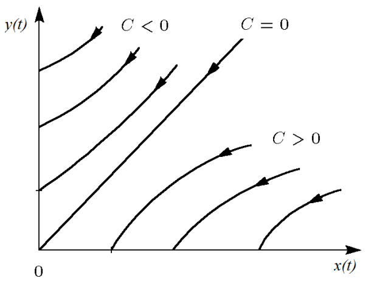
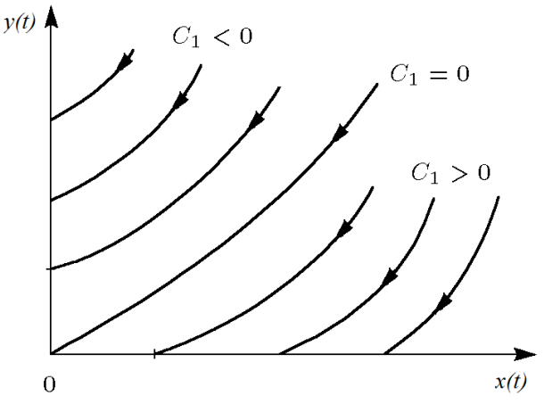
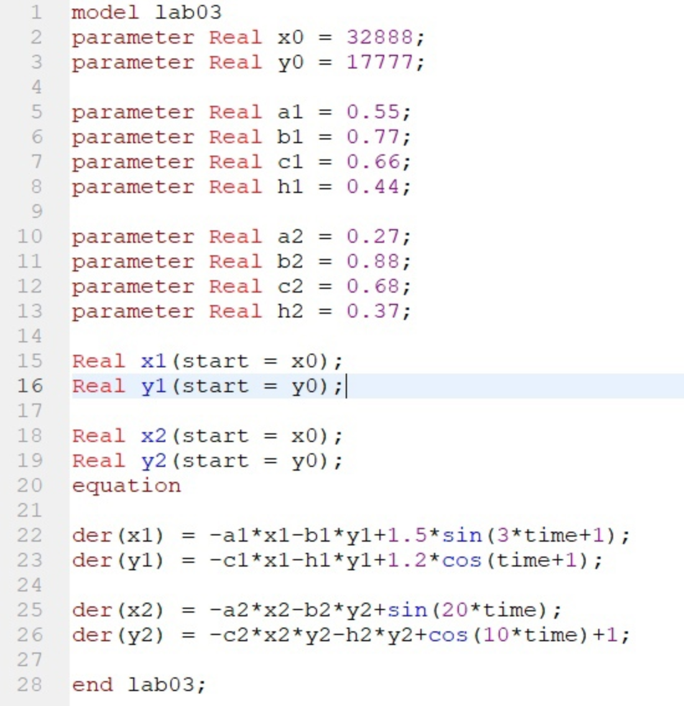
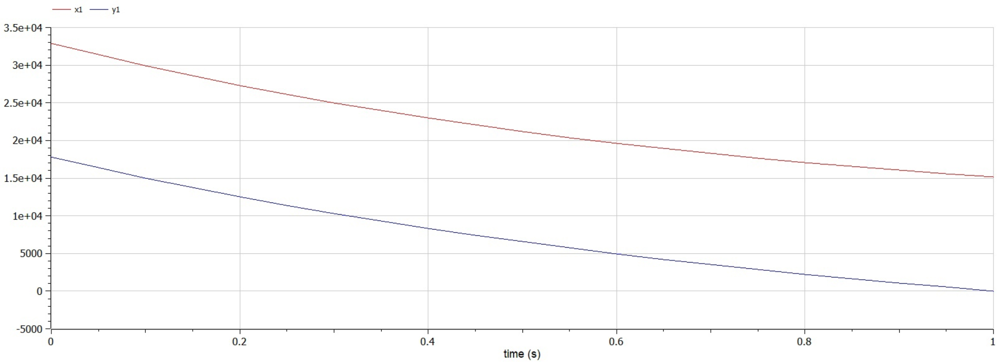
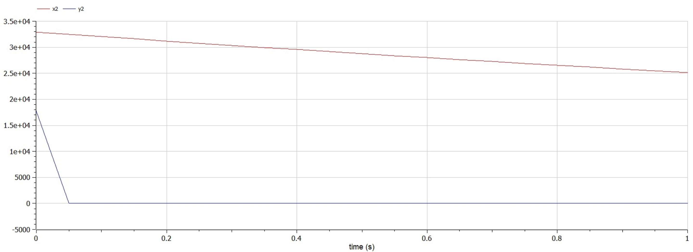

---
# Front matter
title: "Лабораторная работа №3. Модель боевых действий"
subtitle: "Вариант 28"
author: "Смородова Дарья Владимировна"
group: NFIbd-03-19
institute: RUDN University, Moscow, Russian Federation
date: 2022 Feb 26th

# Generic otions
lang: ru-RU
toc-title: "Содержание"

# Bibliography
bibliography: bib/cite.bib
csl: pandoc/csl/gost-r-7-0-5-2008-numeric.csl

# Pdf output format
toc: true # Table of contents
toc_depth: 2
lof: true # List of figures
lot: true # List of tables
fontsize: 12pt
linestretch: 1.5
papersize: a4
documentclass: scrreprt
## I18n
polyglossia-lang:
  name: russian
  options:
	- spelling=modern
	- babelshorthands=true
polyglossia-otherlangs:
  name: english
### Fonts
mainfont: PT Serif
romanfont: PT Serif
sansfont: PT Sans
monofont: PT Mono
mainfontoptions: Ligatures=TeX
romanfontoptions: Ligatures=TeX
sansfontoptions: Ligatures=TeX,Scale=MatchLowercase
monofontoptions: Scale=MatchLowercase,Scale=0.9
## Biblatex
biblatex: true
biblio-style: "gost-numeric"
biblatexoptions:
  - parentracker=true
  - backend=biber
  - hyperref=auto
  - language=auto
  - autolang=other*
  - citestyle=gost-numeric
## Misc options
indent: true
header-includes:
  - \linepenalty=10 # the penalty added to the badness of each line within a paragraph (no associated penalty node) Increasing the value makes tex try to have fewer lines in the paragraph.
  - \interlinepenalty=0 # value of the penalty (node) added after each line of a paragraph.
  - \hyphenpenalty=50 # the penalty for line breaking at an automatically inserted hyphen
  - \exhyphenpenalty=50 # the penalty for line breaking at an explicit hyphen
  - \binoppenalty=700 # the penalty for breaking a line at a binary operator
  - \relpenalty=500 # the penalty for breaking a line at a relation
  - \clubpenalty=150 # extra penalty for breaking after first line of a paragraph
  - \widowpenalty=150 # extra penalty for breaking before last line of a paragraph
  - \displaywidowpenalty=50 # extra penalty for breaking before last line before a display math
  - \brokenpenalty=100 # extra penalty for page breaking after a hyphenated line
  - \predisplaypenalty=10000 # penalty for breaking before a display
  - \postdisplaypenalty=0 # penalty for breaking after a display
  - \floatingpenalty = 20000 # penalty for splitting an insertion (can only be split footnote in standard LaTeX)
  - \raggedbottom # or \flushbottom
  - \usepackage{float} # keep figures where there are in the text
  - \floatplacement{figure}{H} # keep figures where there are in the text
---

# Цель работы

Целью данной лабораторной работы является научиться решать задачу с помощью математического моделирования и программного обеспечения OpenModelica о ведении боевых действий для двух случаев: когда боевые действия ведутся между регулярными войсками, и когда также принимают участие партизанские отряды. 

# Задание

Между страной $X$ и страной $Y$ идет война. Численность состава войск
исчисляется от начала войны, и являются временными функциями $x(t)$ и $y(t)$. В начальный момент времени страна $X$ имеет армию численностью *32 888* человек, а в распоряжении страны $Y$ армия численностью в *17 777* человек. Для упрощения модели считаем, что коэффициенты $a, b, c, h$ постоянны. Также считаем $P(t)$ и $Q(t)$ непрерывные функции.

Постройте графики изменения численности войск армии $X$ и армии $Y$ для
следующих случаев:
1. Модель боевых действий между регулярными войсками:

$$\dfrac{dx}{dt} =  -0,55x(t) - 0,77y(t) + 1,5sin(3t + 1)$$
$$\dfrac{dx}{dt} =  -0,66x(t) - 0,44y(t) + 1,2cos(t + 1)$$

2. Модель ведение боевых действий с участием регулярных войск и
партизанских отрядов: 

$$\dfrac{dx}{dt} =  -0,27x(t) - 0,88y(t) + sin(20t)$$
$$\dfrac{dx}{dt} =  -0,68x(t)y(t) - 0,37y(t) + cos(10t) + 1$$

# Теоретическое введение

Рассмотрим модель боевых действий – модель Ланчестера. В противоборстве могут принимать участие как регулярные войска,
так и партизанские отряды. В общем случае главной характеристикой соперников являются численности сторон. Если в какой-то момент времени одна из численностей обращается в нуль, то данная сторона считается проигравшей (при условии, что численность другой стороны в данный момент положительна).

Рассмотрим три случая ведения боевых действий:

1. Боевые действия между регулярными войсками

2. Боевые действия с участием регулярных войск и партизанских
отрядов

3. Боевые действия между партизанскими отрядами

В первом случае численность регулярных войск определяется тремя
факторами:

- скорость уменьшения численности войск из-за причин, не связанных с
боевыми действиями (болезни, травмы, дезертирство);

- скорость потерь, обусловленных боевыми действиями противоборствующих сторон (что связанно с качеством стратегии, уровнем вооружения, профессионализмом солдат и т.п.);

- скорость поступления подкрепления (задаётся некоторой функцией от
времени).

В этом случае модель боевых действий между регулярными войсками
описывается следующим образом (1):

$$\dfrac{dx}{dt} = -a(t)x(t) - b(t)y(t) + P(t)$$
$$\dfrac{dy}{dt} = -c(t)x(t) - h(t)y(t) + Q(t)$$

Потери, не связанные с боевыми действиями, описывают члены $-a(t)x(t)$ и $-h(t)y(t)$, члены $-b(t)y(t)$ и $-c(t)x(t)$ отражают потери на поле боя.Коэффициенты $b(t)$ и $c(t)$ указывают на эффективность боевых действий со стороны у и х соответственно, $a(t)$ и $h(t)$ - величины, характеризующие степень влияния различных факторов на потери. Функции $P(t)$, $Q(t)$ учитывают возможность подхода подкрепления к войскам $X$ и $Y$ в течение одного дня.

Во втором случае в борьбу добавляются партизанские отряды. Нерегулярные войска в отличии от постоянной армии менее уязвимы, так как действуют скрытно, в этом случае сопернику приходится действовать неизбирательно, по площадям, занимаемым партизанами. Поэтому считается, что тем потерь партизан, проводящих свои операции в разных местах на некоторой известной территории, пропорционален не только численности армейских соединений, но и численности самих партизан. В результате модель принимает вид (2):

$$\dfrac{dx}{dt} = -a(t)x(t) - b(t)y(t) + P(t)$$
$$\dfrac{dy}{dt} = -c(t)x(t)y(t) - h(t)y(t) + Q(t)$$

В этой системе все величины имею тот же смысл, что и в системе (1).

Модель ведение боевых действий между партизанскими отрядами с учетом предположений, сделанном в предыдущем случаем, имеет вид (3):

$$\dfrac{dx}{dt} = -a(t)x(t) - b(t)x(t)y(t) + P(t)$$
$$\dfrac{dy}{dt} = - h(t)y(t) -c(t)x(t)y(t) + Q(t)$$

В простейшей модели борьбы двух противников коэффициенты $b(t)$ и $c(t)$ являются постоянными. Попросту говоря, предполагается, что каждый солдат армии x убивает за единицу времени c солдат армии y (и, соответственно, каждый солдат армии y убивает b солдат армии x). Также не учитываются потери, не связанные с боевыми действиями, и возможность подхода подкрепления. Состояние системы описывается точкой (x,y) положительного квадранта плоскости. Координаты этой точки, x и y - это численности противостоящих армий. Тогда модель принимает вид (4):
$$\left\{ 
\begin{array}{c}
\dot{x} = -by \\ 
\dot{y} = -cx \\ 
\end{array}
\right. $$

Это - жесткая модель, которая допускает точное решение (5):

$$\dfrac{dx}{dy} = \dfrac{by}{cx}$$

$$cxdx = bydy, cx^2 - by^2 = C$$

Эволюция численностей армий $x$ и $y$ происходит вдоль гиперболы, заданной этим уравнением (fig.[-@fig:001]). По какой именно гиперболе пойдет война, зависит от начальной точки.

{ #fig:001 width=70% }

Эти гиперболы разделены прямой $\sqrt{c}x = \sqrt{b}y$. Если начальная точка лежит выше этой прямой, то гипербола выходит на ось $y$. Это значит, что в ходе войны численность армии $x$ уменьшается до нуля (за конечное время). Армия y выигрывает, противник уничтожен. 

Если начальная точка лежит ниже, то выигрывает армия $x$. В разделяющем эти случаи состоянии (на прямой) война заканчивается истреблением обеих армий. Но на это требуется бесконечно большое время: конфликт продолжает тлеть, когда оба противника уже обессилены. 

Вывод модели таков: для борьбы с вдвое более многочисленным противником нужно в четыре раза более мощное оружие, с втрое более многочисленным - в девять раз и т. д. (на это указывают квадратные корни в уравнении прямой).

Стоит помнить, что эта модель сильно идеализирована и неприменима к реальной ситуации. Но может использоваться для начального анализа.

Если рассматривать второй случай (война между регулярными войсками и партизанскими отрядами) с теми же упрощениями, то модель (2) принимает вид (6):

$$\dfrac{dx}{dt} = -by(t)$$
$$\dfrac{dy}{dt} = -cx(t)y(t)$$

Эта система приводится к уравнению (7):

$$\dfrac{d}{dt}\left(\dfrac{b}{2}x^2(t) - cy(t)\right) = 0,$$

которое при заданных начальных условиях имеет единственное решение (8):

$$\dfrac{b}{2}x^2(t) - cy(t) = \dfrac{b}{2}x^2(0) - cy(0) = C_1$$

{ #fig:002 width=70% }

Из (fig.[-@fig:002]) видно, что при $C_1>0$ побеждает регулярная армия, при $C_1<0$ побеждают партизаны. Аналогично противоборству регулярных войск, победа обеспечивается не только начальной численностью, но и боевой выучкой и качеством вооружения. При $C_1>0$ получаем соотношение $\dfrac{b}{2}x^2(0) > cy(0)$. Чтобы одержать победу партизанам необходимо увеличить коэффициент $c$ и повысить свою начальную численность на соответствующую величину. Причем это увеличение, с ростом начальной численности регулярных войск ($x(0)$), должно расти не линейно, а пропорционально второй степени $x(0)$. Таким образом, можно сделать вывод, что регулярные войска находятся в более выгодном положении, так как неравенство для них выполняется прим меньшем росте начальной численности войск.

Рассмотренные простейшие модели соперничества соответствуют системам обыкновенных дифференциальных уравнений второго порядка, широко распространенным при описании многих естественно научных объектов. [^1]

# Выполнение лабораторной работы

1. Выполнять данную лабораторную работу я буду в программе OpenModelica.

2. Напишем программу для построения боевых моделей для обоих случаев (fig.[-@fig:003]):

{ #fig:003 width=70% }

3. Построим график для первого случая (fig.[-@fig:004]):

{ #fig:004 width=70% }

4. Построим график для второго случая (fig.[-@fig:005]):

{ #fig:005 width=70% }

# Выводы  

В ходе данной лабораторной работы, мы научились решать задачу с помощью математического моделирования и программного обеспечения OpenModelica о ведении боевых действий для двух случаев: когда боевые действия ведутся между регулярными войсками, и когда также принимают участие партизанские отряды. 

# Список литературы

1. [Кулябов, Д.С. Модель боевых действий / Д.С.Кулябов. - Москва: - 7 с.](https://esystem.rudn.ru/pluginfile.php/1343885/mod_resource/content/2/Лабораторная%20работа%20№%202.pdf)

[^1]: Кулябов, Д.С. Модель боевых действий.