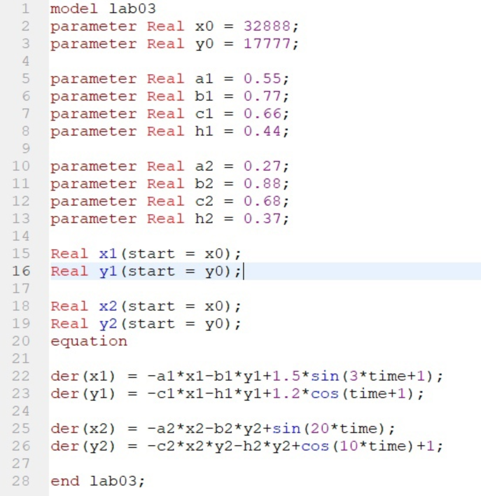
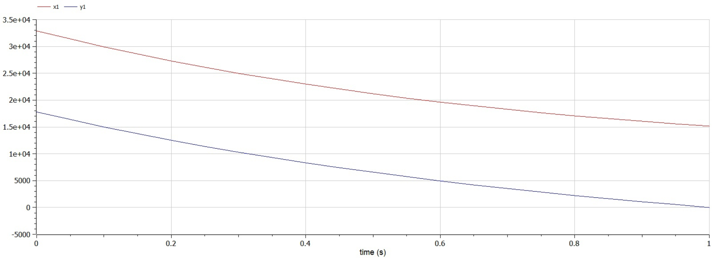
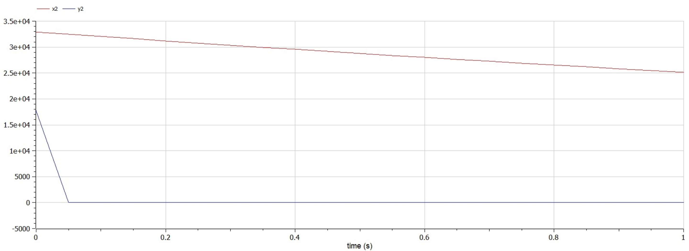

---
# Front matter
lang: ru-RU
title: Защита лабораторной работы №3. Модель боевых действий
author: "Смородова Дарья Владимировна"
group: NFIbd-03-19
institute: RUDN University, Moscow, Russian Federation
date: 2022 Feb 26th

# Formatting
toc: false
slide_level: 2
theme: metropolis
header-includes:
  - \metroset{progressbar=frametitle,sectionpage=progressbar,numbering=fraction}
  - '\makeatletter'
  - '\beamer@ignorenonframefalse'
  - '\makeatother' 
aspectratio: 43 
section-titles: true
---

# Цель выполнения лабораторной работы
Целью данной лабораторной работы является научиться решать задачу с помощью математического моделирования и программного обеспечения OpenModelica о ведении боевых действий для двух случаев: когда боевые действия ведутся между регулярными войсками, и когда также принимают участие партизанские отряды.   

# Задачи выполнения лабораторной работы

## Вариант 28
Между страной $X$ и страной $Y$ идет война. Численность состава войск
исчисляется от начала войны, и являются временными функциями $x(t)$ и $y(t)$. В начальный момент времени страна $X$ имеет армию численностью *32 888* человек, а в распоряжении страны $Y$ армия численностью в *17 777* человек. Для упрощения модели считаем, что коэффициенты $a, b, c, h$ постоянны. Также считаем $P(t)$ и $Q(t)$ непрерывные функции.

## Вариант 28
Постройте графики изменения численности войск армии $X$ и армии $Y$ для
следующих случаев:
1. Модель боевых действий между регулярными войсками:

$$\dfrac{dx}{dt} =  -0,55x(t) - 0,77y(t) + 1,5sin(3t + 1)$$
$$\dfrac{dx}{dt} =  -0,66x(t) - 0,44y(t) + 1,2cos(t + 1)$$

2. Модель ведение боевых действий с участием регулярных войск и
партизанских отрядов: 

$$\dfrac{dx}{dt} =  -0,27x(t) - 0,88y(t) + sin(20t)$$
$$\dfrac{dx}{dt} =  -0,68x(t)y(t) - 0,37y(t) + cos(10t) + 1$$

# Теоретические данные 

## Основные уравнение задачи 

Модель боевых действий между регулярными войсками:  
$\frac{dx}{dt} = -a(t)x(t)-b(t)y(t)+P(t)$  
$\frac{dy}{dt} = -c(t)x(t)-h(t)y(t)+Q(t)$   

Модель ведение боевых действий с участием регулярных войск и партизанских отрядов:  
$\frac{dx}{dt} = -a(t)x(t)-b(t)y(t)+P(t)$  
$\frac{dy}{dt} = -c(t)x(t)y(t)-h(t)y(t)+Q(t)$  

# Результаты выполнения лабораторной работы

## Код программы

## График для первого случая

## График для второго случая

# Выводы

1. Научились решать задачу с помощью математического моделирования и программного обеспечения OpenModelica о ведении боевых действий для двух случаев: когда боевые действия ведутся между регулярными войсками, и когда также принимают участие партизанские отряды;

2. Написали код решения данной задачи в OpenModelica;

3. Построили графики для обоих случаев.
