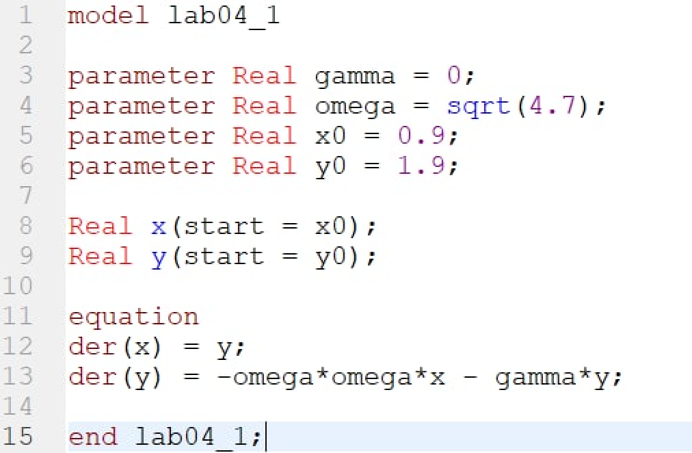
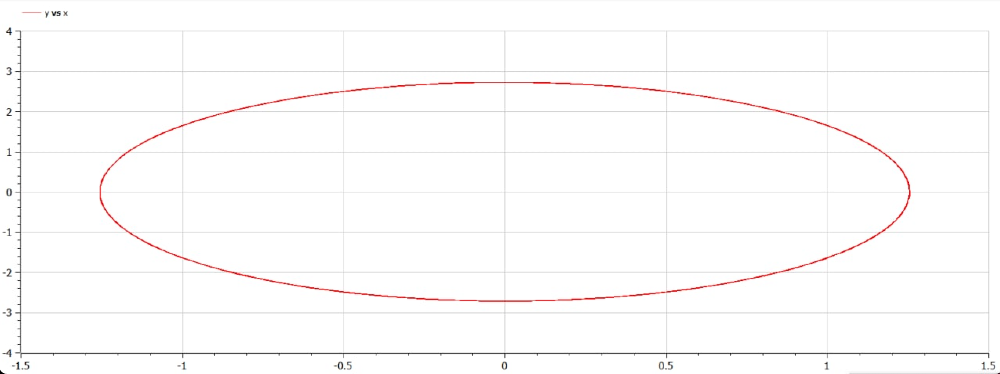
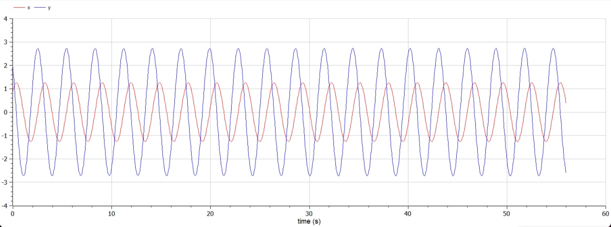
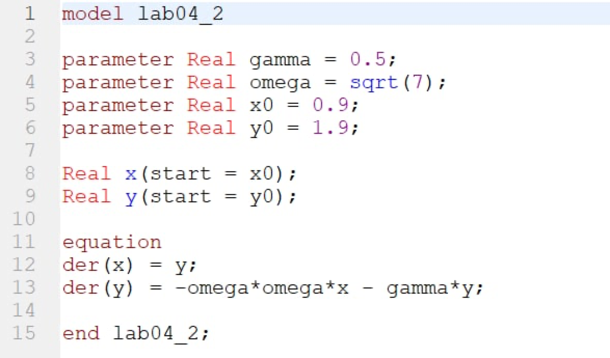
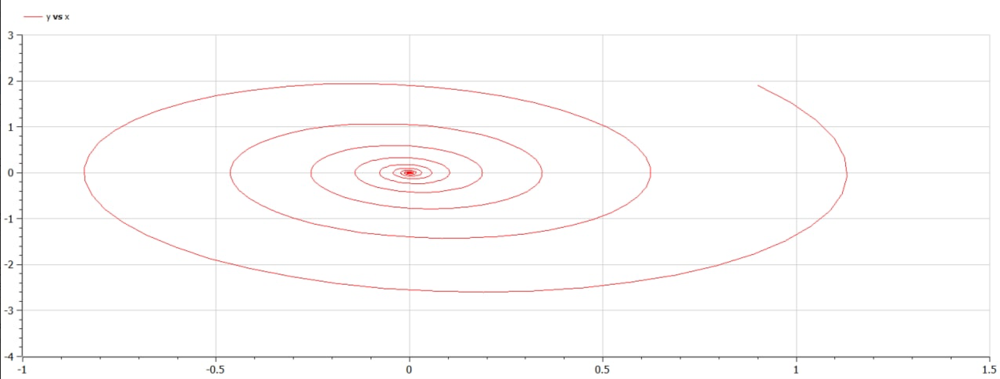
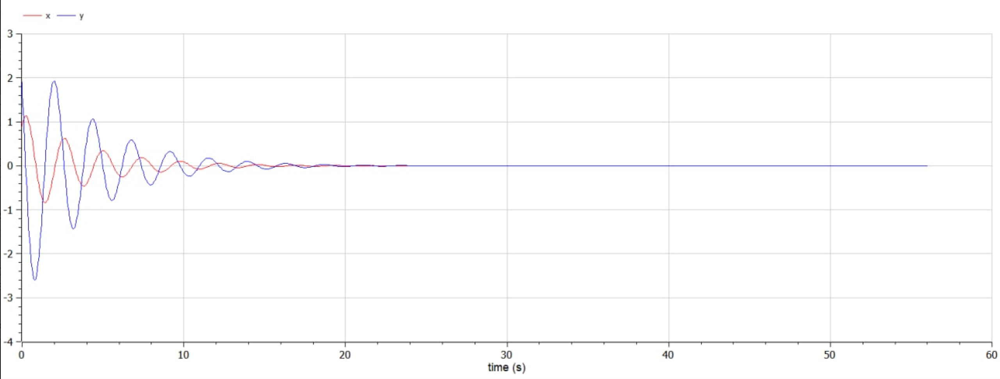
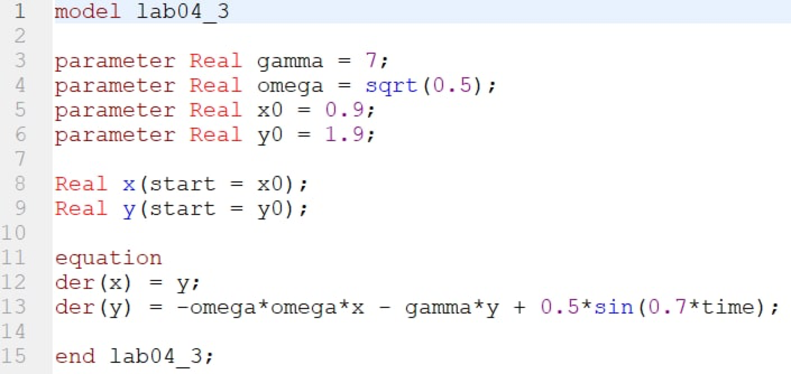
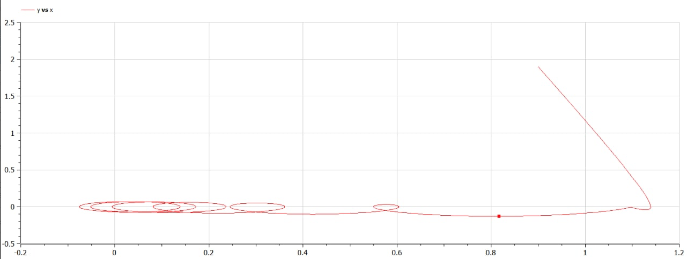
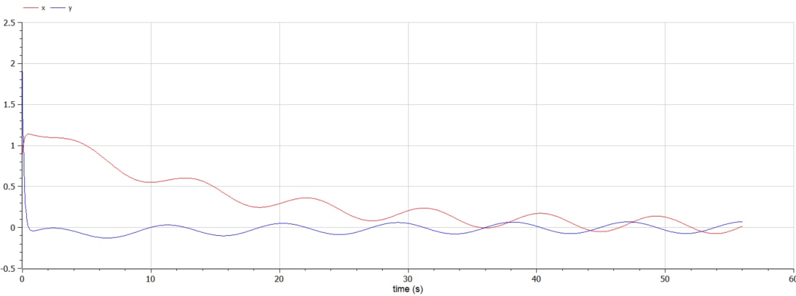

---
# Front matter
lang: ru-RU
title: Защита лабораторной работы №4. Модель гармонических колебаний
author: "Смородова Дарья Владимировна"
group: NFIbd-03-19
institute: RUDN University, Moscow, Russian Federation
date: 2022 March 5th

# Formatting
toc: false
slide_level: 2
theme: metropolis
header-includes:
  - \metroset{progressbar=frametitle,sectionpage=progressbar,numbering=fraction}
  - '\makeatletter'
  - '\beamer@ignorenonframefalse'
  - '\makeatother' 
aspectratio: 43 
section-titles: true
---

# Цель выполнения лабораторной работы

Научиться строить модели гармонических колебаний на примере линейного гармонического осциллятора, построить фазовый портрет гармонического осциллятора и решить уравнения гармонического осциллятора для трех случаев: 

1. Колебания гармонического осциллятора без затуханий и без действий внешней силы.

2. Колебания гармонического осциллятора c затуханием и без действий внешней силы.

3. Колебания гармонического осциллятора c затуханием и под действием внешней силы. 

# Задание лабораторной работы

## Вариант 28

Постройте фазовый портрет гармонического осциллятора и решение уравнения гармонического осциллятора для следующих случаев:

1. Колебания гармонического осциллятора без затуханий и без действий внешней силы $\ddot x + 4.7x = 0$
2. Колебания гармонического осциллятора c затуханием и без действий внешней силы $\ddot x + 0.5\dot x + 7x = 0$
3.  Колебания гармонического осциллятора c затуханием и под действием внешней силы $\ddot x + 7\dot x + 0.5x = 0.5sin(0.7t)$

На интервале $t \in [0; 56]$ (шаг 0.05) с начальными условиями $x_0=0.9, y_0 = 1.9$

# Теоретические данные 

## Основные уравнение задачи  

Уравнение свободных колебаний гармонического осциллятора имеет
следующий вид:  

$$ \ddot {x} + 2 \gamma \dot {x} + w_0^2x = f(t) $$  

При отсутствии потерь в системе получаем уравнение консервативного осциллятора, энергия колебания которого сохраняется во времени:

$$ \ddot {x} + w_0^2x = 0 $$

Для однозначной разрешимости уравнения второго порядка необходимо задать два начальных условия вида:
$$\begin{cases}
   x(t_0) = x_0 \\
   \dot x(t_0) = y_0
 \end{cases}$$

## Основные уравнение задачи  

Уравнение второго порядка можно представить в виде системы двух уравнений первого порядка:

$$\begin{cases}
   \dot x =y \\
   \dot y = - \omega_0^2 x 
 \end{cases}$$

Начальные условия для системы примут вид:

$$\begin{cases}
   x(t_0) = x_0 \\
   y(t_0) = y_0
 \end{cases}$$

# Результаты выполнения лабораторной работы

## Код программы для первого случая

## Фазовый портрет для первого случая

## Решение уравнения гармонического осциллятора для первого случая

## Код программы для второго случая

## Фазовый портрет для второго случая

## Решение уравнения гармонического осциллятора для второго случая

## Код программы для третьего случая

## Фазовый портрет для третьего случая

## Решение уравнения гармонического осциллятора для третьего случая

# Выводы

1. Научились строить модели гармонических колебаний на примере линейного гармонического осциллятора. 

2. Написали код решения данной задачи в OpenModelica;

3. Построили фазовый портрет гармонического осциллятора и решили уравнения гармонического осциллятора для трех случаев:

    1. Колебания гармонического осциллятора без затуханий и без действий внешней силы.

    2. Колебания гармонического осциллятора c затуханием и без действий внешней силы.

    3. Колебания гармонического осциллятора c затуханием и под действием внешней силы.
