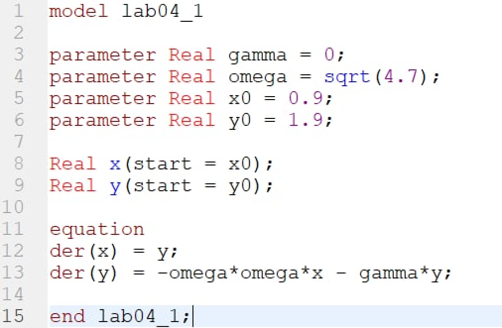
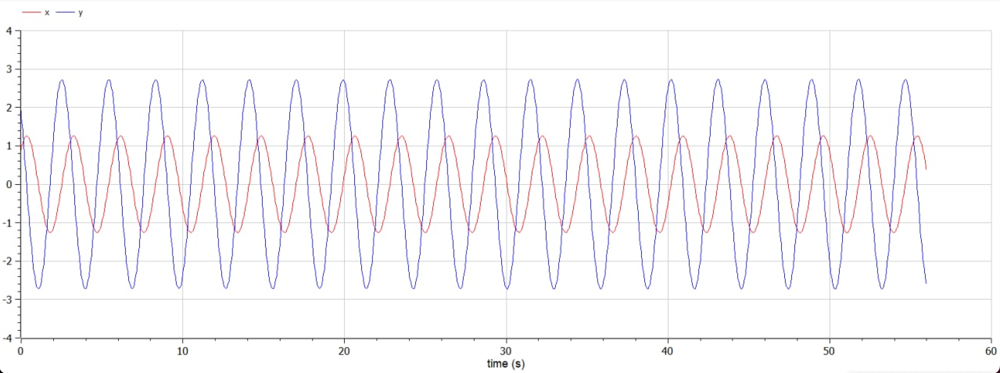
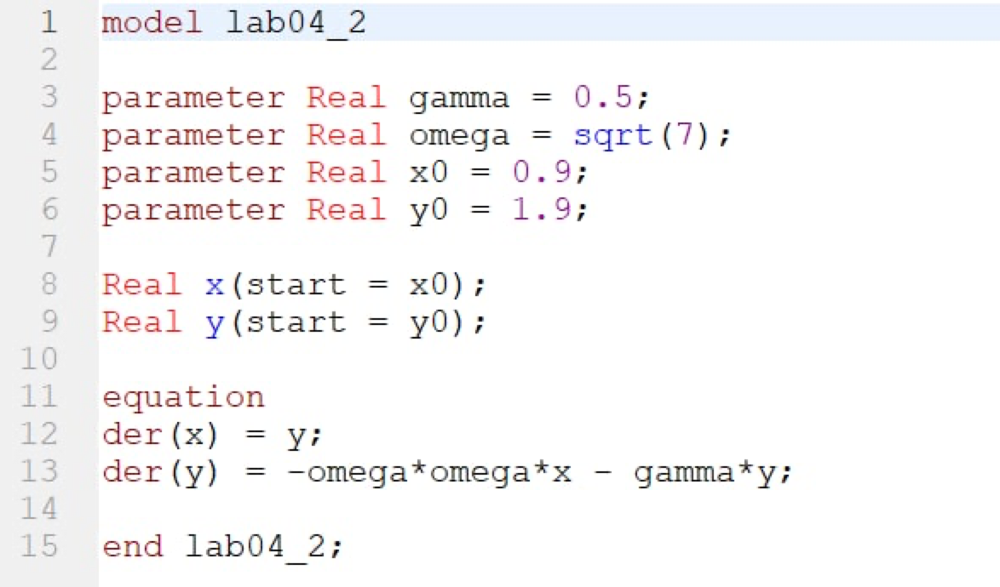
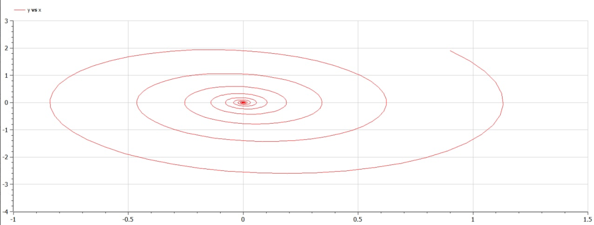
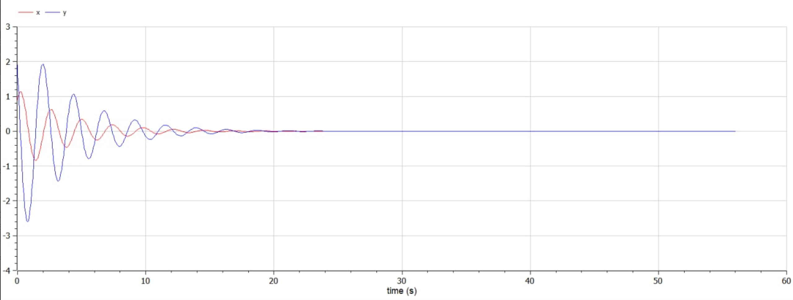
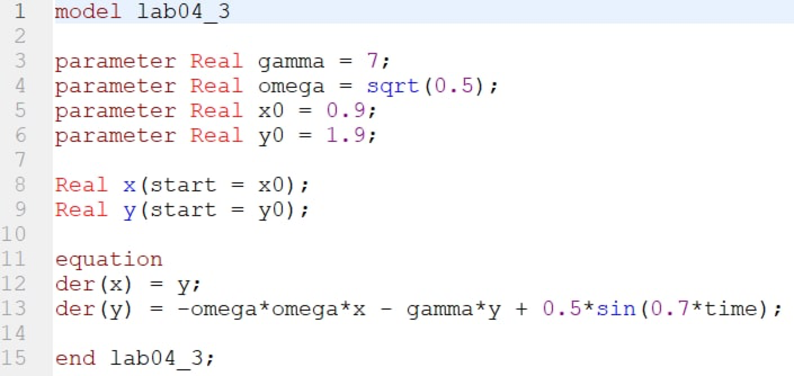
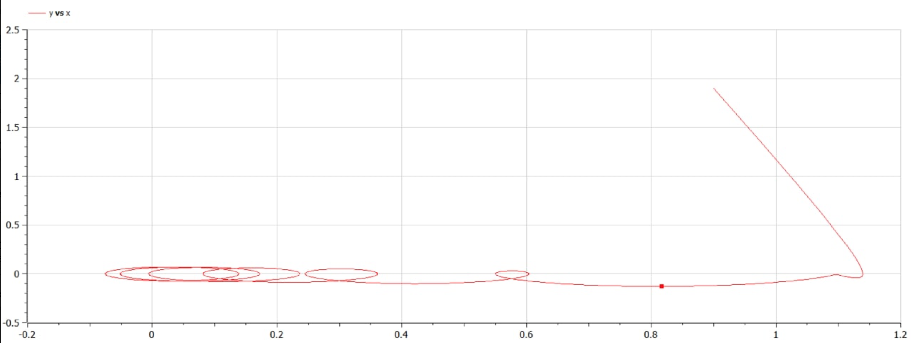
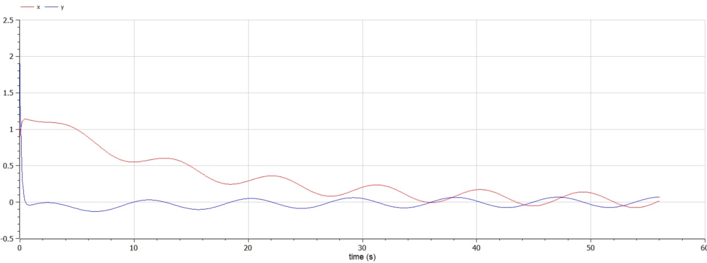

---
# Front matter
title: "Лабораторная работа №4. Модель гармонических колебаний"
subtitle: "Вариант 28"
author: "Смородова Дарья Владимировна"
group: NFIbd-03-19
institute: RUDN University, Moscow, Russian Federation
date: 2022 March 5th

# Generic otions
lang: ru-RU
toc-title: "Содержание"

# Bibliography
bibliography: bib/cite.bib
csl: pandoc/csl/gost-r-7-0-5-2008-numeric.csl

# Pdf output format
toc: true # Table of contents
toc_depth: 2
lof: true # List of figures
lot: true # List of tables
fontsize: 12pt
linestretch: 1.5
papersize: a4
documentclass: scrreprt
## I18n
polyglossia-lang:
  name: russian
  options:
	- spelling=modern
	- babelshorthands=true
polyglossia-otherlangs:
  name: english
### Fonts
mainfont: PT Serif
romanfont: PT Serif
sansfont: PT Sans
monofont: PT Mono
mainfontoptions: Ligatures=TeX
romanfontoptions: Ligatures=TeX
sansfontoptions: Ligatures=TeX,Scale=MatchLowercase
monofontoptions: Scale=MatchLowercase,Scale=0.9
## Biblatex
biblatex: true
biblio-style: "gost-numeric"
biblatexoptions:
  - parentracker=true
  - backend=biber
  - hyperref=auto
  - language=auto
  - autolang=other*
  - citestyle=gost-numeric
## Misc options
indent: true
header-includes:
  - \linepenalty=10 # the penalty added to the badness of each line within a paragraph (no associated penalty node) Increasing the value makes tex try to have fewer lines in the paragraph.
  - \interlinepenalty=0 # value of the penalty (node) added after each line of a paragraph.
  - \hyphenpenalty=50 # the penalty for line breaking at an automatically inserted hyphen
  - \exhyphenpenalty=50 # the penalty for line breaking at an explicit hyphen
  - \binoppenalty=700 # the penalty for breaking a line at a binary operator
  - \relpenalty=500 # the penalty for breaking a line at a relation
  - \clubpenalty=150 # extra penalty for breaking after first line of a paragraph
  - \widowpenalty=150 # extra penalty for breaking before last line of a paragraph
  - \displaywidowpenalty=50 # extra penalty for breaking before last line before a display math
  - \brokenpenalty=100 # extra penalty for page breaking after a hyphenated line
  - \predisplaypenalty=10000 # penalty for breaking before a display
  - \postdisplaypenalty=0 # penalty for breaking after a display
  - \floatingpenalty = 20000 # penalty for splitting an insertion (can only be split footnote in standard LaTeX)
  - \raggedbottom # or \flushbottom
  - \usepackage{float} # keep figures where there are in the text
  - \floatplacement{figure}{H} # keep figures where there are in the text
---

# Цель работы

Целью данной лабораторной работы является научиться строить модели гармонических колебаний на примере линейного гармонического осциллятора, построить фазовый портрет гармонического осциллятора и решить уравнения гармонического осциллятора для трех случаев: 

1. Колебания гармонического осциллятора без затуханий и без действий внешней силы.

2. Колебания гармонического осциллятора c затуханием и без действий внешней силы.

3. Колебания гармонического осциллятора c затуханием и под действием внешней силы.

# Задание

Постройте фазовый портрет гармонического осциллятора и решение уравнения гармонического осциллятора для следующих случаев:

1. Колебания гармонического осциллятора без затуханий и без действий внешней силы $\ddot x + 4.7x = 0$
2. Колебания гармонического осциллятора c затуханием и без действий внешней силы $\ddot x + 0.5\dot x + 7x = 0$
3.  Колебания гармонического осциллятора c затуханием и под действием внешней силы $\ddot x + 7\dot x + 0.5x = 0.5sin(0.7t)$

На интервале $t \in [0; 56]$ (шаг 0.05) с начальными условиями $x_0=0.9, y_0 = 1.9$

# Теоретическое введение

Движение грузика на пружинке, маятника, заряда в электрическом контуре, а также эволюция во времени многих систем в физике, химии, биологии и других науках при определенных предположениях можно описать одним и тем же дифференциальным уравнением, которое в теории колебаний выступает в качестве основной модели. Эта модель называется линейным гармоническим осциллятором. Уравнение свободных колебаний гармонического осциллятора имеетследующий вид (1):

$$\ddot{x} + 2\gamma\dot{x} +\omega_0^2 x = 0$$

где x – переменная, описывающая состояние системы (смещение грузика, заряд конденсатора и т.д.), $\gamma$– параметр, характеризующий потери энергии (трение в механической системе, сопротивление в контуре), $\omega_0$ – собственная частота колебаний, t – время. (Обозначения $\ddot{x}=\dfrac{\partial^2x}{\partial t}, \dot{x}=\dfrac{\partial x}{\partial t}$)

Уравнение (1) есть линейное однородное дифференциальное уравнение второго порядка и оно является примером линейной динамической системы. При отсутствии потерь в системе ($\gamma=0$) вместо уравнения (1) получаем уравнение консервативного осциллятора энергия колебания которого сохраняется во времени (2):

$$\ddot{x} + \omega_0^2 x = 0$$

Для однозначной разрешимости уравнения второго порядка (2) необходимо задать два начальных условия вида (3):

$$\begin{cases}
   x(t_0) = x_0 \\
   \dot x(t_0) = y_0
 \end{cases}$$

Уравнение второго порядка (2) можно представить в виде системы двух уравнений первого порядка (4):

$$\begin{cases}
   \dot x =y \\
   \dot y = - \omega_0^2 x 
 \end{cases}$$

Начальные условия (3) для системы (4) примут вид (5):

$$\begin{cases}
   x(t_0) = x_0 \\
   y(t_0) = y_0
 \end{cases}$$

Независимые переменные x, y определяют пространство, в котором «движется» решение. Это фазовое пространство системы, поскольку оно двумерно будем называть его фазовой плоскостью. Значение фазовых координат x, y в любой момент времени полностью определяет состояние системы. Решению уравнения движения как функции времени отвечает гладкая кривая в фазовой плоскости. Она называется фазовой траекторией. Если множество различных решений (соответствующих различным начальным условиям) изобразить на одной фазовой плоскости, возникает общая картина поведения системы. Такую картину, образованную набором фазовых траекторий, называют фазовым портретом.[^1]

# Выполнение лабораторной работы

1. Выполнять данную лабораторную работу я буду в программе OpenModelica.

2. Напишем программу для построения модели гармонических колебаний для первого случая: колебания гармонического осциллятора без затуханий и без действий внешней силы (fig.[-@fig:001]):

{ #fig:001 width=70% }

3. Получим фазовый портрет гармонического осциллятора для первого случая: колебания гармонического осциллятора без затуханий и без действий внешней силы (fig.[-@fig:002]):

{ #fig:002 width=70% }

4. Получим решение уравнения гармонического осциллятора для первого случая: колебания гармонического осциллятора без затуханий и без действий внешней силы (fig.[-@fig:003]):

{ #fig:003 width=70% }

5. Напишем программу для построения модели гармонических колебаний для второго случая: колебания гармонического осциллятора c затуханием и без действий внешней силы (fig.[-@fig:004]):

{ #fig:004 width=70% }

6. Получим фазовый портрет гармонического осциллятора для второго случая: колебания гармонического осциллятора c затуханием и без действий внешней силы (fig.[-@fig:005]):

{ #fig:005 width=70% }

7. Получим решение уравнения гармонического осциллятора для второго случая: колебания гармонического осциллятора c затуханием и без действий внешней силы (fig.[-@fig:006]):

{ #fig:006 width=70% }

8. Напишем программу для построения модели гармонических колебаний для третьего случая: колебания гармонического осциллятора c затуханием и под действием внешней силы (fig.[-@fig:007]):

{ #fig:007 width=70% }

9. Получим фазовый портрет гармонического осциллятора для третьего случая: колебания гармонического осциллятора c затуханием и под действием внешней силы (fig.[-@fig:008]):

{ #fig:008 width=70% }

10. Получим решение уравнения гармонического осциллятора для третьего случая: колебания гармонического осциллятора c затуханием и под действием внешней силы (fig.[-@fig:009]):

{ #fig:009 width=70% }

# Выводы  

В ходе данной лабораторной работы, мы научились строить модели гармонических колебаний на примере линейного гармонического осциллятора. Мы построили фазовый портрет гармонического осциллятора и решили уравнения гармонического осциллятора для трех случаев:

1. Колебания гармонического осциллятора без затуханий и без действий внешней силы.

2. Колебания гармонического осциллятора c затуханием и без действий внешней силы.

3. Колебания гармонического осциллятора c затуханием и под действием внешней силы.

# Список литературы

1. [Кулябов, Д.С. Модель гармонических колебаний / Д.С.Кулябов. - Москва: - 7 с.](https://esystem.rudn.ru/pluginfile.php/1343889/mod_resource/content/2/%D0%9B%D0%B0%D0%B1%D0%BE%D1%80%D0%B0%D1%82%D0%BE%D1%80%D0%BD%D0%B0%D1%8F%20%D1%80%D0%B0%D0%B1%D0%BE%D1%82%D0%B0%20%E2%84%96%203.pdf)

[^1]: Кулябов, Д.С. Модель гармонических колебаний.