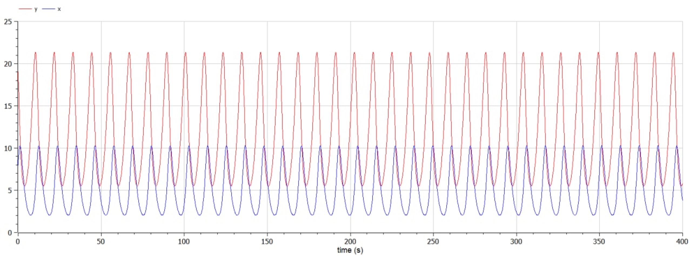
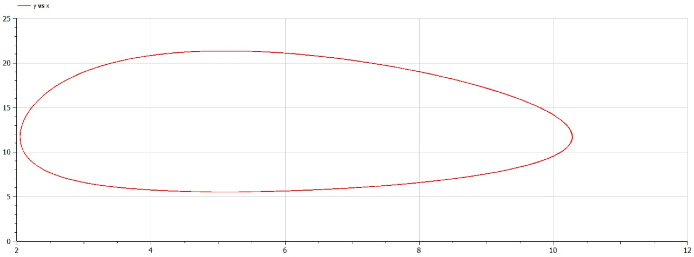
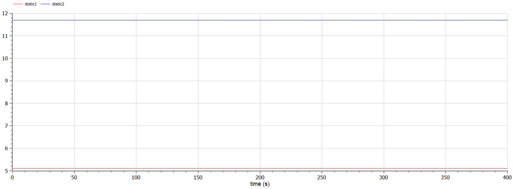

---
# Front matter
lang: ru-RU
title: Защита лабораторной работы №5. Модель хищник - жертва
author: "Смородова Дарья Владимировна"
group: NFIbd-03-19
institute: RUDN University, Moscow, Russian Federation
date: 2022 March 12th

# Formatting
toc: false
slide_level: 2
theme: metropolis
header-includes:
  - \metroset{progressbar=frametitle,sectionpage=progressbar,numbering=fraction}
  - '\makeatletter'
  - '\beamer@ignorenonframefalse'
  - '\makeatother' 
aspectratio: 43 
section-titles: true
---

# Цель выполнения лабораторной работы

1. Изучить особенности модели хищник-жертва;

2. Построить график зависимости и график изменения численности хищников от численности жертв при заданных начальных условиях;

3. Найти стационарное состояние системы.

# Задание лабораторной работы

## Вариант 28

Для модели «хищник-жертва»:

$$\begin{cases}
   \dfrac{dx}{dt} = -0.69x(t) + 0.059x(t)y(t)\\
   \dfrac{dy}{dt} = 0.49y(t) - 0.096x(t)y(t)
 \end{cases}$$
 
Постройте график зависимости численности хищников от численности жертв, а также графики изменения численности хищников и численности жертв при следующих начальных условиях: $x_0 = 8, y_0 = 19$. Найдите стационарное состояние системы.

# Теоретические данные 

## Основные уравнение задачи  

Простейшая модель взаимодействия двух видов типа «хищник — жертва» - модель Лотки-Вольтерры:

$$\begin{cases}
   \dfrac{dx}{dt} = ax(t) - bx(t)y(t)\\
   \dfrac{dy}{dt} = - cy(t) + dx(t)y(t)
 \end{cases}$$

## Основные уравнение задачи  

$x$ – число жертв, 

$y$ - число хищников, 

$a$ - скорость естественного прироста числа жертв в отсутствие хищников, 

$c$ - естественное вымирание хищников, лишенных пищи в виде жертв. 

Каждый акт взаимодействия уменьшает популяцию жертв, но способствует увеличению популяции хищников (члены $-bxy$ и $dxy$ в правой части уравнения).

Стационарное состояние системы: $x_0 = \dfrac{c}{d}, y_0 = \dfrac{a}{b}$

# Результаты выполнения лабораторной работы

## Код программы 

## График изменения численности хищников и численности жертв

## График зависимости численности хищников от численности жертв

## Стационарное состояние системы

# Выводы

1. Изучили особенности модели хищник-жертва;

2. Построили график зависимости и график изменения численности хищников от численности жертв при заданных начальных условиях;

3. Нашли стационарное состояние системы.
