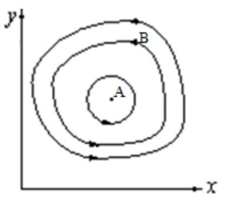
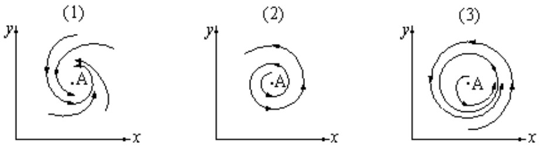
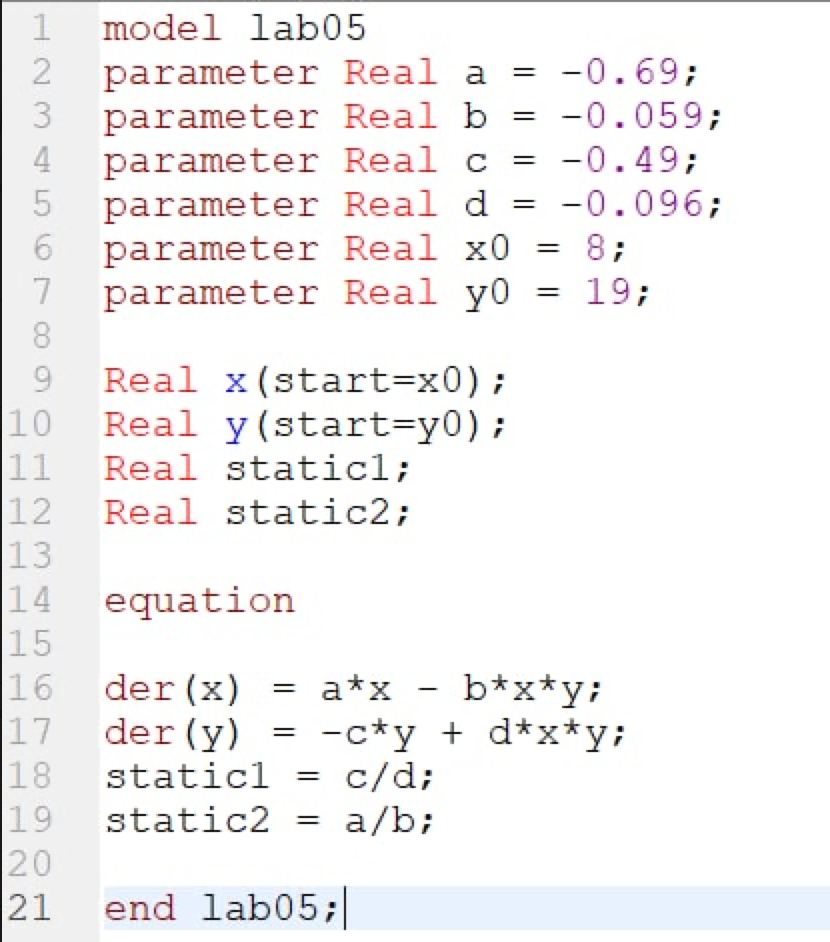
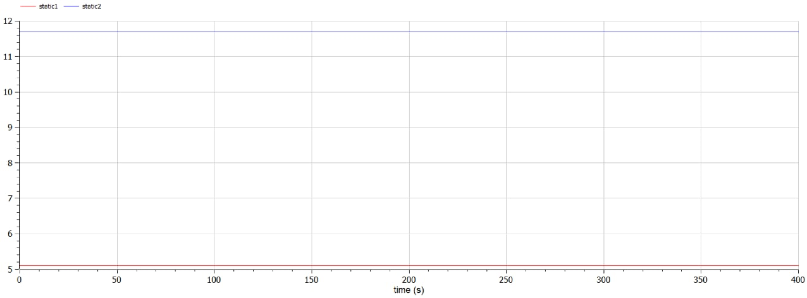

---
# Front matter
title: "Лабораторная работа №5. Модель хищник - жертва"
subtitle: "Вариант 28"
author: "Смородова Дарья Владимировна"
group: NFIbd-03-19
institute: RUDN University, Moscow, Russian Federation
date: 2022 March 12th

# Generic otions
lang: ru-RU
toc-title: "Содержание"

# Bibliography
bibliography: bib/cite.bib
csl: pandoc/csl/gost-r-7-0-5-2008-numeric.csl

# Pdf output format
toc: true # Table of contents
toc_depth: 2
lof: true # List of figures
lot: true # List of tables
fontsize: 12pt
linestretch: 1.5
papersize: a4
documentclass: scrreprt
## I18n
polyglossia-lang:
  name: russian
  options:
	- spelling=modern
	- babelshorthands=true
polyglossia-otherlangs:
  name: english
### Fonts
mainfont: PT Serif
romanfont: PT Serif
sansfont: PT Sans
monofont: PT Mono
mainfontoptions: Ligatures=TeX
romanfontoptions: Ligatures=TeX
sansfontoptions: Ligatures=TeX,Scale=MatchLowercase
monofontoptions: Scale=MatchLowercase,Scale=0.9
## Biblatex
biblatex: true
biblio-style: "gost-numeric"
biblatexoptions:
  - parentracker=true
  - backend=biber
  - hyperref=auto
  - language=auto
  - autolang=other*
  - citestyle=gost-numeric
## Misc options
indent: true
header-includes:
  - \linepenalty=10 # the penalty added to the badness of each line within a paragraph (no associated penalty node) Increasing the value makes tex try to have fewer lines in the paragraph.
  - \interlinepenalty=0 # value of the penalty (node) added after each line of a paragraph.
  - \hyphenpenalty=50 # the penalty for line breaking at an automatically inserted hyphen
  - \exhyphenpenalty=50 # the penalty for line breaking at an explicit hyphen
  - \binoppenalty=700 # the penalty for breaking a line at a binary operator
  - \relpenalty=500 # the penalty for breaking a line at a relation
  - \clubpenalty=150 # extra penalty for breaking after first line of a paragraph
  - \widowpenalty=150 # extra penalty for breaking before last line of a paragraph
  - \displaywidowpenalty=50 # extra penalty for breaking before last line before a display math
  - \brokenpenalty=100 # extra penalty for page breaking after a hyphenated line
  - \predisplaypenalty=10000 # penalty for breaking before a display
  - \postdisplaypenalty=0 # penalty for breaking after a display
  - \floatingpenalty = 20000 # penalty for splitting an insertion (can only be split footnote in standard LaTeX)
  - \raggedbottom # or \flushbottom
  - \usepackage{float} # keep figures where there are in the text
  - \floatplacement{figure}{H} # keep figures where there are in the text
---

# Цель работы

Целью данной лабораторной работы является изучение особенностей модели хищник-жертва, построение графиков зависимости и изменения численности хищников от численности жертв при заданных начальных условиях, а также нахождение стационарного состояние системы.

# Задание

Для модели «хищник-жертва»:

$$\begin{cases}
   \dfrac{dx}{dt} = -0.69x(t) + 0.059x(t)y(t)\\
   \dfrac{dy}{dt} = 0.49y(t) - 0.096x(t)y(t)
 \end{cases}$$
 
Постройте график зависимости численности хищников от численности жертв, а также графики изменения численности хищников и численности жертв при следующих начальных условиях: $x_0 = 8, y_0 = 19$. Найдите стационарное состояние системы.

# Теоретическое введение

Простейшая модель взаимодействия двух видов типа «хищник — жертва» - модель Лотки-Вольтерры. Данная двувидовая модель основывается на следующих предположениях:

1. Численность популяции жертв x и хищников y зависят только от времени (модель не учитывает пространственное распределение популяции на занимаемой территории)
2. В отсутствии взаимодействия численность видов изменяется по модели Мальтуса, при этом число жертв увеличивается, а число хищников падает
3. Естественная смертность жертвы и естественная рождаемость хищника считаются несущественными
4. Эффект насыщения численности обеих популяций не учитывается
5. Скорость роста численности жертв уменьшается пропорционально численности хищников (1):

$$\begin{cases}
   \dfrac{dx}{dt} = ax(t) - bx(t)y(t)\\
   \dfrac{dy}{dt} = - cy(t) + dx(t)y(t)
 \end{cases}$$

В этой модели $x$ – число жертв, $y$ - число хищников. Коэффициент $a$ описывает скорость естественного прироста числа жертв в отсутствие хищников, $c$ - естественное вымирание хищников, лишенных пищи в виде жертв. Вероятность взаимодействия жертвы и хищника считается пропорциональной как количеству жертв, так и числу самих хищников ($xy$). Каждый акт взаимодействия уменьшает популяцию жертв, но способствует увеличению популяции хищников (члены $-bxy$ и $dxy$ в правой части уравнения).

{ #fig:001 width=70% }

Математический анализ этой (жесткой) модели показывает, что имеется стационарное состояние (A на pис.[-@fig:001]), всякое же другое начальное состояние (B) приводит к периодическому колебанию численности как жертв, так и хищников, так что по прошествии некоторого времени система возвращается в состояние B.

Стационарное состояние системы (1) (положение равновесия, не зависящее от времени решение) будет в точке: $x_0 = \dfrac{c}{d}, y_0 = \dfrac{a}{b}$. Если начальные значения задать в стационарном состоянии $x(0) = x_0, y(0) = y_0$, то в любой момент времени численность популяций изменяться не будет. При малом отклонении от положения равновесия численности как хищника, так и жертвы с течением времени не возвращаются к равновесным значениям, а совершают периодические колебания вокруг стационарной точки. Амплитуда колебаний и их период определяется начальными значениями численностей $x(0), y(0)$. Колебания совершаются в противофазе.

При малом изменении модели (2):

$$\begin{cases}
   \dfrac{dx}{dt} = ax(t) - bx(t)y(t) + \varepsilon f(x,y)\\
   \dfrac{dy}{dt} = - cy(t) + dx(t)y(t) + \varepsilon g(x,y), \varepsilon \ll 1 
 \end{cases}$$

(прибавление к правым частям малые члены, учитывающие, например, конкуренцию жертв за пищу и хищников за жертв), вывод о периодичности (возвращении системы в исходное состояние B), справедливый для жесткой системы Лотки-Вольтерры, теряет силу. Таким образом, мы получаем так называемую мягкую модель «хищник-жертва». В зависимости от вида малых поправок f и g возможны следующие сценарии 1-3 (рис.[-@fig:002]).

{ #fig:002 width=70% }

В случае 1 равновесное состояние A устойчиво. При любых других начальных условиях через большое время устанавливается именно оно.

В случае 2 система стационарное состояние неустойчиво. Эволюция приводит то к резкому увеличению числа хищников, то к их почти полному вымиранию. Такая система в конце концов попадает в область столь больших или столь малых значений x и y, что модель перестает быть применимой.

В случае 3 в системе с неустойчивым стационарным состоянием A с течением времени устанавливается периодический режим. В отличие от исходной жесткой модели Лотки-Вольтерры, в этой модели установившийся периодический режим не зависит от начального условия. Первоначально незначительное отклонение от стационарного состояния A приводит не к малым колебаниям около A, как в модели Лотки-Вольтерры, а к колебаниям вполне определенной (и не зависящей от малости отклонения) амплитуды. Возможны и другие структурно устойчивые сценарии (например, с несколькими периодическими режимами).

Вывод: жесткую модель всегда надлежит исследовать на структурную устойчивость полученных при ее изучении результатов по отношению к малым изменениям модели (делающим ее мягкой).

В случае модели Лотки-Вольтерры для суждения о том, какой же из сценариев 1-3 (или иных возможных) реализуется в данной системе, совершенно необходима дополнительная информация о системе (о виде малых поправок $f$ и $g$ в нашей формуле). Математическая теория мягких моделей указывает, какую именно информацию для этого нужно иметь. Без этой информации жесткая модель может привести к качественно ошибочным предсказаниям. Доверять выводам, сделанным на основании жесткой модели, можно лишь тогда, когда они подтверждаются исследованием их структурной устойчивости. [^1]

# Выполнение лабораторной работы

1. Выполнять данную лабораторную работу я буду в программе OpenModelica.

2. Напишем программу для построения графика зависимости численности хищников от численности жертв, а также графика изменения численности хищников и численности жертв при заданных начальных условиях: $x_0 = 8, y_0 = 19$ (fig.[-@fig:003]):

{ #fig:003 width=70% }

3. Получим график изменения численности хищников и численности жертв (fig.[-@fig:004]):

{ #fig:004 width=70% }

5. Получим график зависимости численности хищников от численности жертв (fig.[-@fig:005]):

{ #fig:005 width=70% }

6. Найдем стационарное состояние системы (fig.[-@fig:006]):

{ #fig:006 width=70% }

# Выводы  

В ходе данной лабораторной работы, мы изучили особенностей модели хищник-жертва, построили графиков зависимости и изменения численности хищников от численности жертв при заданных начальных условиях, а также нашли стационарное состояние системы.

# Список литературы

1. [Кулябов, Д.С. Модель хищник - жертва / Д.С.Кулябов. - Москва: - 7 с.](https://esystem.rudn.ru/pluginfile.php/1343893/mod_resource/content/2/%D0%9B%D0%B0%D0%B1%D0%BE%D1%80%D0%B0%D1%82%D0%BE%D1%80%D0%BD%D0%B0%D1%8F%20%D1%80%D0%B0%D0%B1%D0%BE%D1%82%D0%B0%20%E2%84%96%204.pdf)

[^1]: Кулябов, Д.С. Модель хищник - жертва.