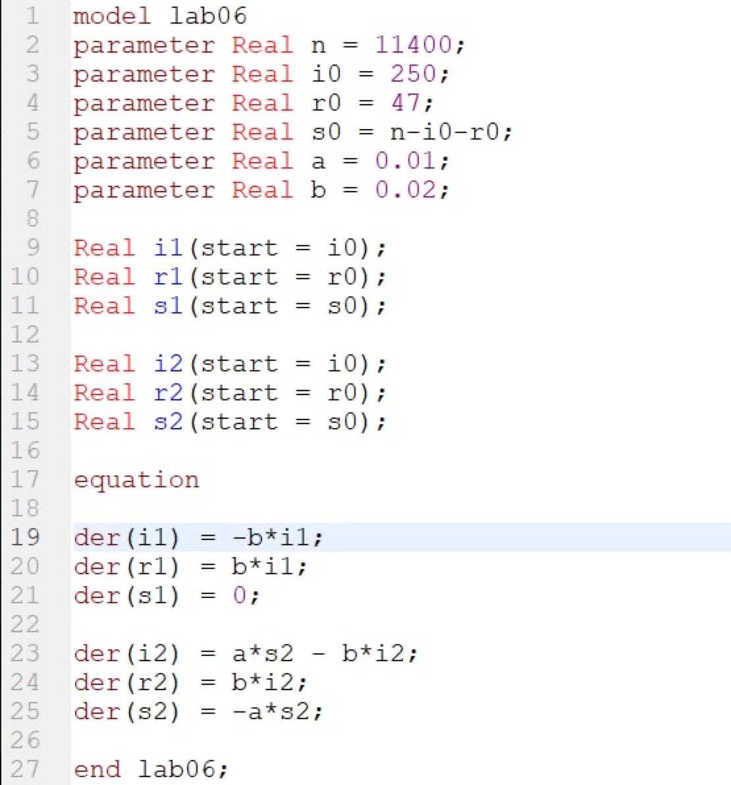
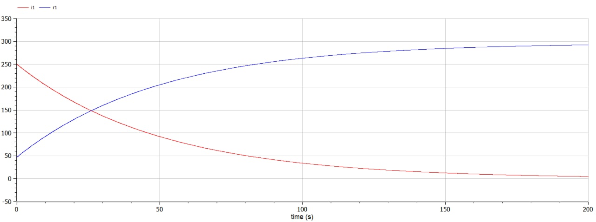
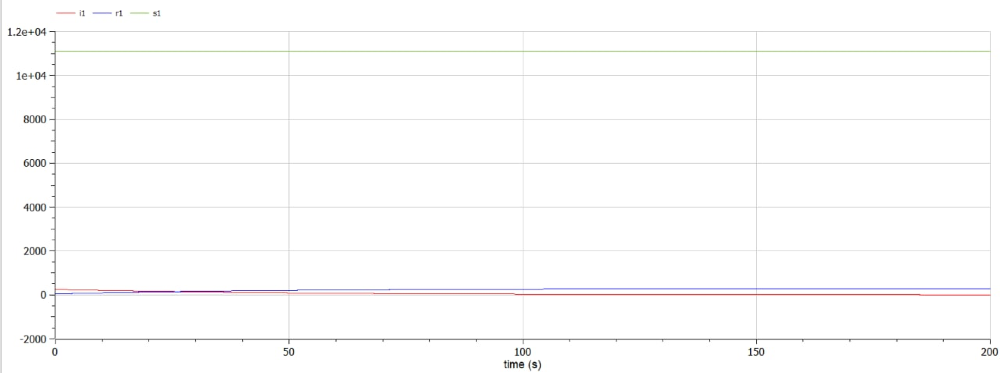
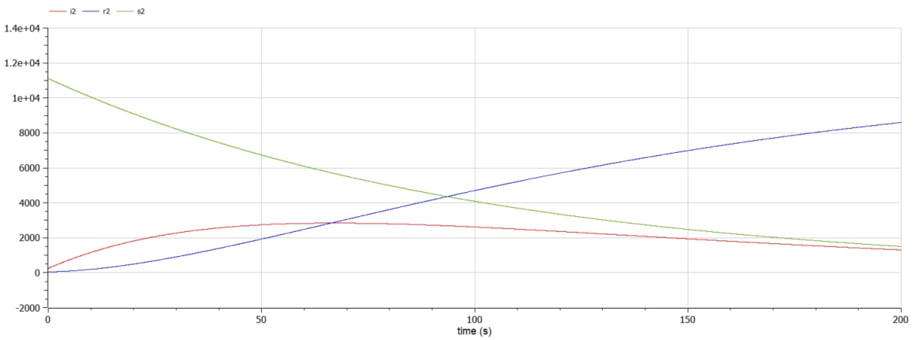

---
# Front matter
lang: ru-RU
title: Защита лабораторной работы №6. Задача об эпидемии
author: "Смородова Дарья Владимировна"
group: NFIbd-03-19
institute: RUDN University, Moscow, Russian Federation
date: 2022 March 19th

# Formatting
toc: false
slide_level: 2
theme: metropolis
header-includes:
  - \metroset{progressbar=frametitle,sectionpage=progressbar,numbering=fraction}
  - '\makeatletter'
  - '\beamer@ignorenonframefalse'
  - '\makeatother' 
aspectratio: 43 
section-titles: true
---

# Цель выполнения лабораторной работы

1. Изучить простейшую модели эпидемии;

2. Построить графики изменения числа особей в трех группах:

 - заболевшие люди, являющиеся распространителями инфекции;
 
 - здоровые люди с имунитетом к болезни;

 - восприимчивые к болезни, но пока здоровые люди.

# Задание лабораторной работы

## Вариант 28

На одном острове вспыхнула эпидемия. Известно, что из всех проживающих
на острове ($N=11 400$) в момент начала эпидемии ($t=0$) число заболевших людей (являющихся распространителями инфекции) $I(0)=250$, А число здоровых людей с иммунитетом к болезни $R(0)=47$. Таким образом, число людей восприимчивых к болезни, но пока здоровых, в начальный момент времени $S(0)=N-I(0)- R(0)$.
Постройте графики изменения числа особей в каждой из трех групп.
Рассмотрите, как будет протекать эпидемия в случае:

1) если $I(0) \leq I^*$

2) если $I(0) > I^*$

# Теоретические данные  

$N$ - число особей в популяции;

$S(t)$ — восприимчивые к болезни, но пока здоровые особи;

$I(t)$ — число инфицированных особей, которые также при этом являются распространителями инфекции;

$R(t)$ — здоровые особи с иммунитетом к болезни.

$\alpha$ — коэффициент заболеваемости

$\beta$ — коэффициент выздоровления

## Основные уравнение задачи  

Скорость изменения числа $S(t)$ меняется по следующему закону:

$$ \frac{dS}{dt} = \left\{ \begin{array}{c} - \alpha S, I(t)>I^* \\ 0, I(t) \leq I^* \end{array} \right.$$

## Основные уравнение задачи 

Скорость изменения числа инфекционных особей представляет разность за единицу времени между заразившимися и теми, кто уже болеет и лечится:

$$ \frac{dI}{dt} = \left\{ \begin{array}{c} - \alpha S - \beta I, I(t)>I^* \\ - \beta I, I(t) \leq I^* \end{array} \right.$$

## Основные уравнение задачи 

Скорость изменения выздоравливающих особей (при этом приобретающие иммунитет к болезни):

$$ \frac{dR}{dt} = \beta I$$

# Результаты выполнения лабораторной работы

## Код программы 

{ #fig:001 width=55% }

## График для первого случая без учета восприимчивых к болезни людей

## График для первого случая с учетом восприимчивых к болезни людей

## График для второго случая

# Выводы

1. Изучили простейшую модели эпидемии;

2. Построили графики изменения числа особей в трех группах:

 - заболевшие люди, являющиеся распространителями инфекции;
 
 - здоровые люди с имунитетом к болезни;

 - восприимчивые к болезни, но пока здоровые люди.
