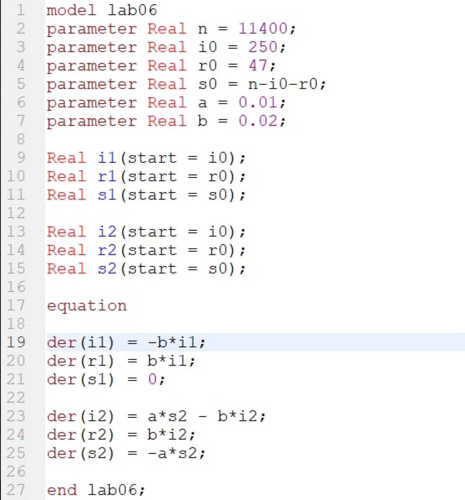
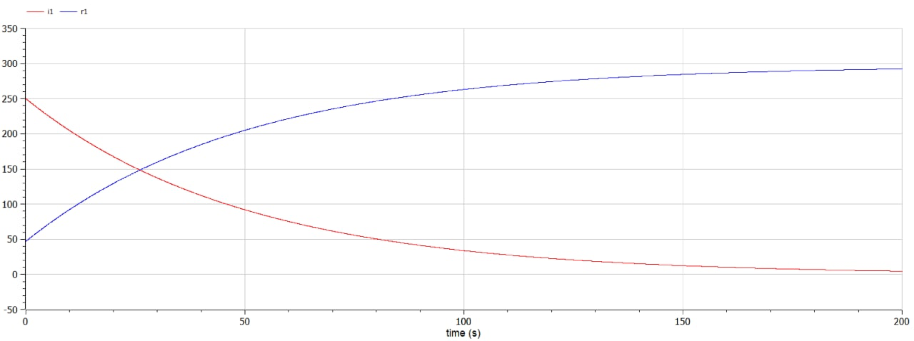
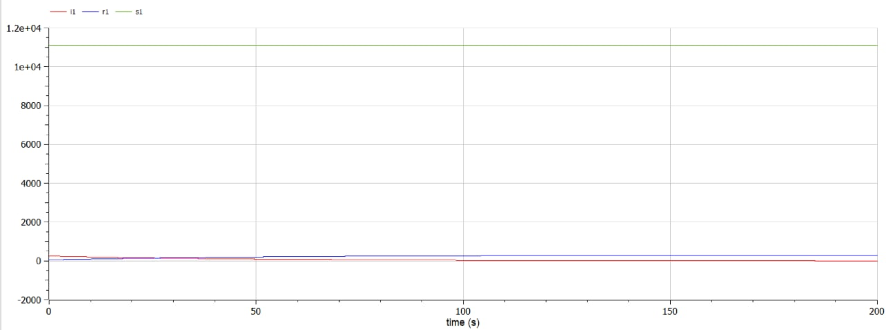
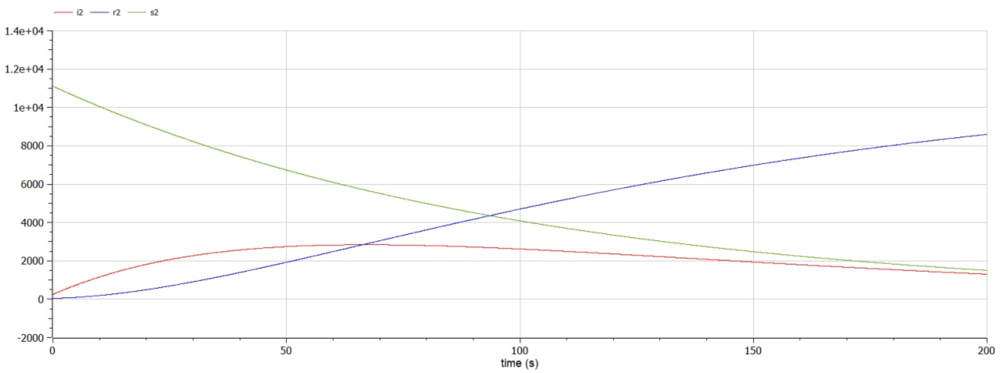

---
# Front matter
title: "Лабораторная работа №6. Задача об эпидемии"
subtitle: "Вариант 28"
author: "Смородова Дарья Владимировна"
group: NFIbd-03-19
institute: RUDN University, Moscow, Russian Federation
date: 2022 March 19th

# Generic otions
lang: ru-RU
toc-title: "Содержание"

# Bibliography
bibliography: bib/cite.bib
csl: pandoc/csl/gost-r-7-0-5-2008-numeric.csl

# Pdf output format
toc: true # Table of contents
toc_depth: 2
lof: true # List of figures
lot: true # List of tables
fontsize: 12pt
linestretch: 1.5
papersize: a4
documentclass: scrreprt
## I18n
polyglossia-lang:
  name: russian
  options:
	- spelling=modern
	- babelshorthands=true
polyglossia-otherlangs:
  name: english
### Fonts
mainfont: PT Serif
romanfont: PT Serif
sansfont: PT Sans
monofont: PT Mono
mainfontoptions: Ligatures=TeX
romanfontoptions: Ligatures=TeX
sansfontoptions: Ligatures=TeX,Scale=MatchLowercase
monofontoptions: Scale=MatchLowercase,Scale=0.9
## Biblatex
biblatex: true
biblio-style: "gost-numeric"
biblatexoptions:
  - parentracker=true
  - backend=biber
  - hyperref=auto
  - language=auto
  - autolang=other*
  - citestyle=gost-numeric
## Misc options
indent: true
header-includes:
  - \linepenalty=10 # the penalty added to the badness of each line within a paragraph (no associated penalty node) Increasing the value makes tex try to have fewer lines in the paragraph.
  - \interlinepenalty=0 # value of the penalty (node) added after each line of a paragraph.
  - \hyphenpenalty=50 # the penalty for line breaking at an automatically inserted hyphen
  - \exhyphenpenalty=50 # the penalty for line breaking at an explicit hyphen
  - \binoppenalty=700 # the penalty for breaking a line at a binary operator
  - \relpenalty=500 # the penalty for breaking a line at a relation
  - \clubpenalty=150 # extra penalty for breaking after first line of a paragraph
  - \widowpenalty=150 # extra penalty for breaking before last line of a paragraph
  - \displaywidowpenalty=50 # extra penalty for breaking before last line before a display math
  - \brokenpenalty=100 # extra penalty for page breaking after a hyphenated line
  - \predisplaypenalty=10000 # penalty for breaking before a display
  - \postdisplaypenalty=0 # penalty for breaking after a display
  - \floatingpenalty = 20000 # penalty for splitting an insertion (can only be split footnote in standard LaTeX)
  - \raggedbottom # or \flushbottom
  - \usepackage{float} # keep figures where there are in the text
  - \floatplacement{figure}{H} # keep figures where there are in the text
---

# Цель работы

Целью данной лабораторной работы является изучение простейшей модели эпидемии и построение графиков изменения числа особей в трех группах:

 - заболевшие люди, являющиеся распространителями инфекции;
 
 - здоровые люди с имунитетом к болезни;

 - восприимчивые к болезни, но пока здоровые люди.

# Задание

На одном острове вспыхнула эпидемия. Известно, что из всех проживающих
на острове ($N=11 400$) в момент начала эпидемии ($t=0$) число заболевших людей (являющихся распространителями инфекции) $I(0)=250$, А число здоровых людей с иммунитетом к болезни $R(0)=47$. Таким образом, число людей восприимчивых к болезни, но пока здоровых, в начальный момент времени $S(0)=N-I(0)- R(0)$.
Постройте графики изменения числа особей в каждой из трех групп.
Рассмотрите, как будет протекать эпидемия в случае:

1) если $I(0) \leq I^*$

2) если $I(0) > I^*$

# Теоретическое введение

Рассмотрим простейшую модель эпидемии. Предположим, что некая популяция, состоящая из N особей, (считаем, что популяция изолирована) подразделяется на три группы. Первая группа - $S(t)$ — восприимчивые к болезни, но пока здоровые особи. Вторая - $I(t)$ — это число инфицированных особей, которые также при этом являются распространителями инфекции. И третья - $R(t)$ — это здоровые особи с иммунитетом к болезни.

До того, как число заболевших не превышает критического значения $I^*$ считаем, что все больные изолированы и не заражают здоровых. Когда $I(t)>I^*$, тогда инфицирование способны заражать восприимчивых к болезни особей.

Таким образом, скорость изменения числа $S(t)$ меняется по следующему закону:

$$ \frac{dS}{dt} = \left\{ \begin{array}{c} - \alpha S, I(t)>I^* \\ 0, I(t) \leq I^* \end{array} \right.$$

Поскольку каждая восприимчивая к болезни особь, которая, в конце концов, заболевает, сама становится инфекционной, то скорость изменения числа инфекционных особей представляет разность за единицу времени между заразившимися и теми, кто уже болеет и лечится, т.е.:

$$ \frac{dI}{dt} = \left\{ \begin{array}{c} - \alpha S - \beta I, I(t)>I^* \\ - \beta I, I(t) \leq I^* \end{array} \right.$$

А скорость изменения выздоравливающих особей (при этом приобретающие иммунитет к болезни):

$$ \frac{dR}{dt} = \beta I$$

Постоянные пропорциональности:

$\alpha$ — коэффициент заболеваемости

$\beta$ — коэффициент выздоровления

Для анализа картины протекания эпидемии необходимо рассмотреть два случая: $I(0) \leq I^*$ и $I(0) > I^*$ [^1]

# Выполнение лабораторной работы

1. Выполнять данную лабораторную работу я буду в программе OpenModelica.

2. Напишем программу для построения графиков изменения числа особей в каждой из трёх групп (fig.[-@fig:001]): 
 - заболевшие люди, являющиеся распространителями инфекции;
 
 - здоровые люди с имунитетом к болезни;

 - восприимчивые к болезни, но пока здоровые люди.

{ #fig:001 width=70% }

3. Получим график изменения числа особей в каждой из трёх групп для первого случая без учета восприимчивых к болезни людей (fig.[-@fig:002]):

{ #fig:002 width=70% }

4. Получим график изменения числа особей в каждой из трёх групп для первого случая с учетом восприимчивых к болезни людей (fig.[-@fig:003]):

{ #fig:003 width=70% }

5. Получим график изменения числа особей в каждой из трёх групп для второго случая (fig.[-@fig:004]):

{ #fig:004 width=70% }

# Выводы  

В ходе данной лабораторной работы, мы изучили простейшую модель эпидемии и построили графики изменения числа особей в трех группах:

 - заболевшие люди, являющиеся распространителями инфекции;
 
 - здоровые люди с имунитетом к болезни;

 - восприимчивые к болезни, но пока здоровые люди.

# Список литературы

1. [Кулябов Д.С. Задача об эпидемии / Д. С. Кулябов. - Москва: - 7 с.](https://esystem.rudn.ru/pluginfile.php/1343897/mod_resource/content/2/%D0%9B%D0%B0%D0%B1%D0%BE%D1%80%D0%B0%D1%82%D0%BE%D1%80%D0%BD%D0%B0%D1%8F%20%D1%80%D0%B0%D0%B1%D0%BE%D1%82%D0%B0%20%E2%84%96%205.pdfD0%B0%D1%8F%20%D1%80%D0%B0%D0%B1%D0%BE%D1%82%D0%B0%20%E2%84%96%204.pdf)

[^1]: Кулябов Д.С. Задача об эпидемии.