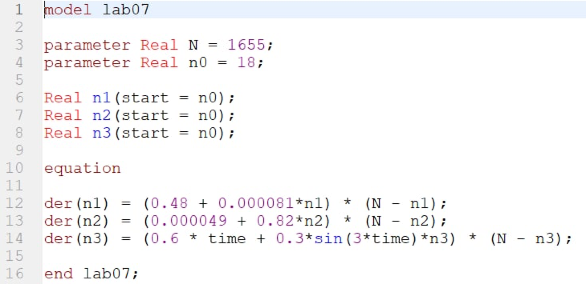
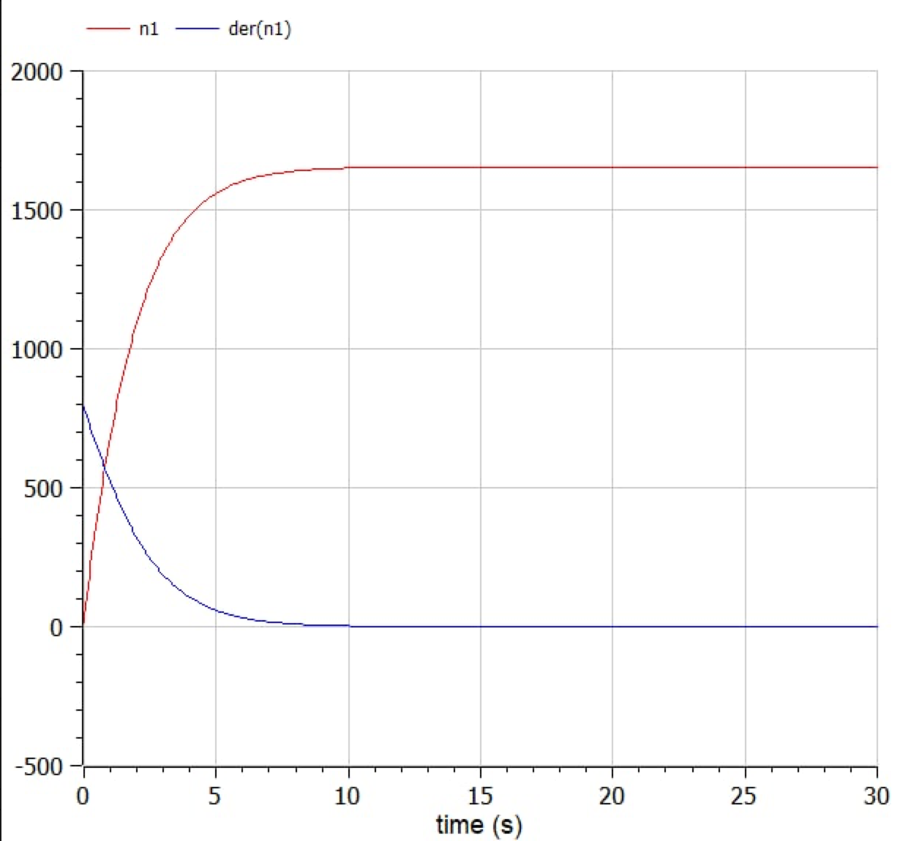
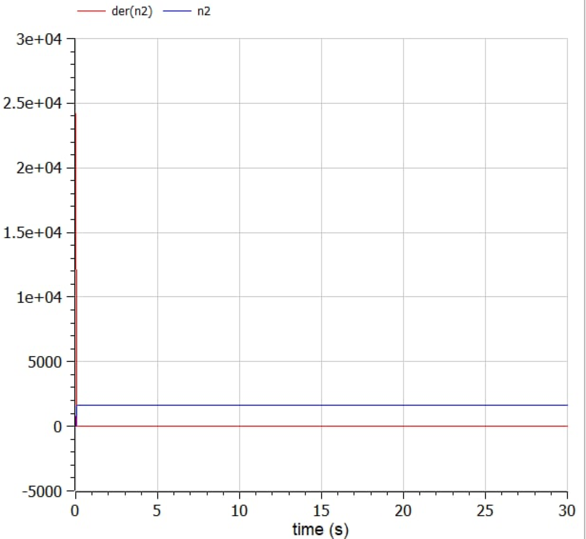
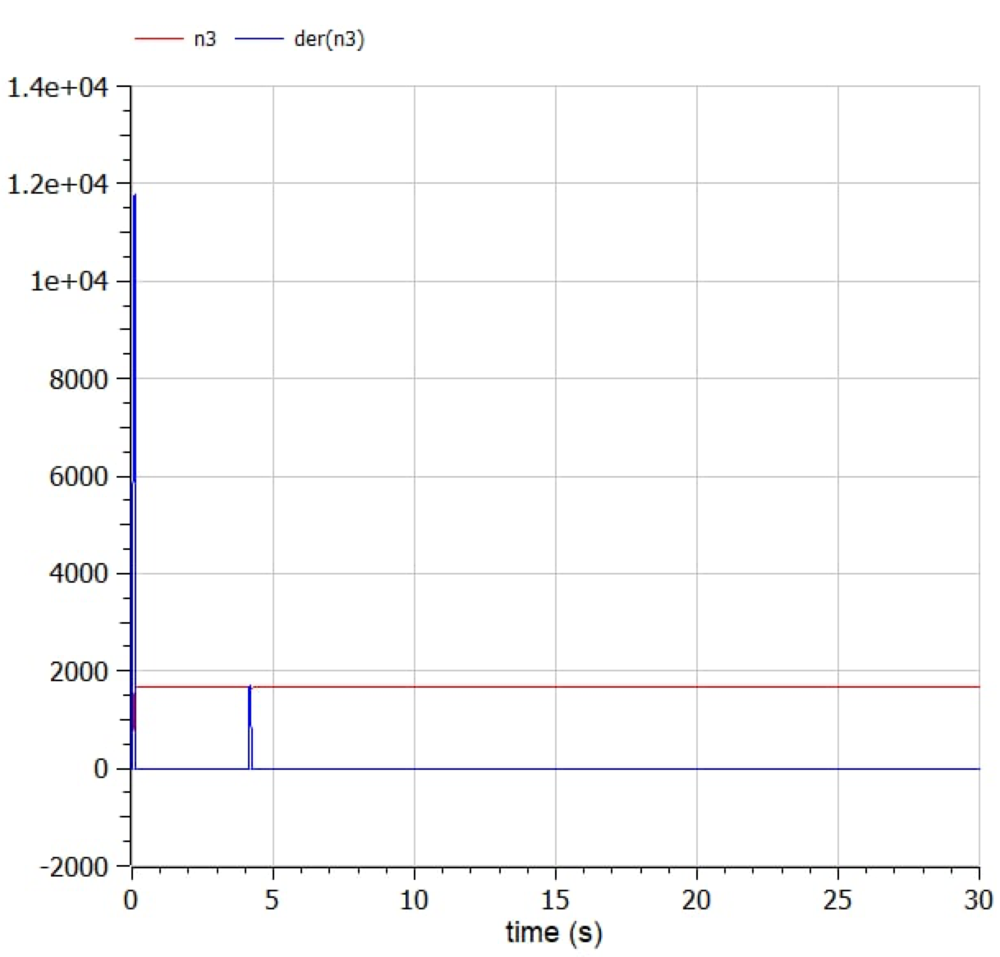
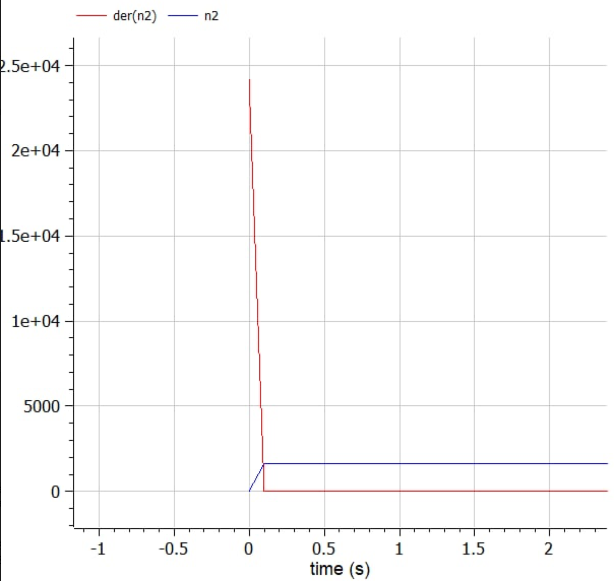

---
# Front matter
lang: ru-RU
title: Защита лабораторной работы №7. Эффективность рекламы
author: "Смородова Дарья Владимировна"
group: NFIbd-03-19
institute: RUDN University, Moscow, Russian Federation
date: 2022 March 26th

# Formatting
toc: false
slide_level: 2
theme: metropolis
header-includes:
  - \metroset{progressbar=frametitle,sectionpage=progressbar,numbering=fraction}
  - '\makeatletter'
  - '\beamer@ignorenonframefalse'
  - '\makeatother' 
aspectratio: 43 
section-titles: true
---

# Цель выполнения лабораторной работы

1. Изучить задачe об эффективности рекламы;

2. Написать код для построения графиков; 

3. Построить графики распространения рекламы в трёх случаях;

4. Определить для второго случая, в какой момент времени скорость распространения рекламы будет иметь максимальное значение.

# Задание лабораторной работы

## Вариант 28

Постройте график распространения рекламы, математическая модель которой описывается следующим уравнением:

1. $\dfrac{dn}{dt} = (0.48 + 0.000081n(t))(N - n(t))$
2. $\dfrac{dn}{dt} = (0.000049 + 0.82n(t))(N - n(t))$
3. $\dfrac{dn}{dt} = (0.6t + 0.3sin(3t)n(t))(N - n(t))$

При этом объем аудитории $N = 1655$, в начальный момент о товаре знает 18 человек. Для случая 2 определите, в какой момент времени скорость распространения рекламы будет иметь максимальное значение.

# Теоретические данные  

## Основное уравнение задачи  

Математическая модель распространения рекламы описывается уравнением:

$$dn/dt = (\alpha_1(t) + \alpha_2(t)n(t))(N-n(t)))$$

$N$ - общее число потенциальных платежеспособных покупателей

$n(t)$ - число уже информированных клиентов;

$t$ - время, прошедшее с рекламной кампании;

$\alpha_1(t)>0$ - интенсивность рекламной кампании;

$\alpha_2(t)$ - вклад сарафанного радио в рекламную кампанию.

# Результаты выполнения лабораторной работы

## Код программы 

## График распространения рекламы для первого случая

{ #fig:004 width=70% }

## График распространения рекламы для второго случая

{ #fig:005 width=70% }

## График распространения рекламы для третьего случая

{ #fig:007 width=70% }

## График изменения скорости распространения рекламы для второго случая

{ #fig:006 width=65% }

# Выводы

1. Изучили задачу об эффективности рекламы;

2. Написали код для построения графиков; 

3. Построили графики распространения рекламы в трёх случаях;

4. Определили для второго случая, в какой момент времени скорость распространения рекламы будет иметь максимальное значение.
