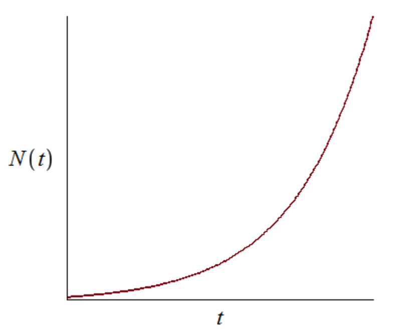
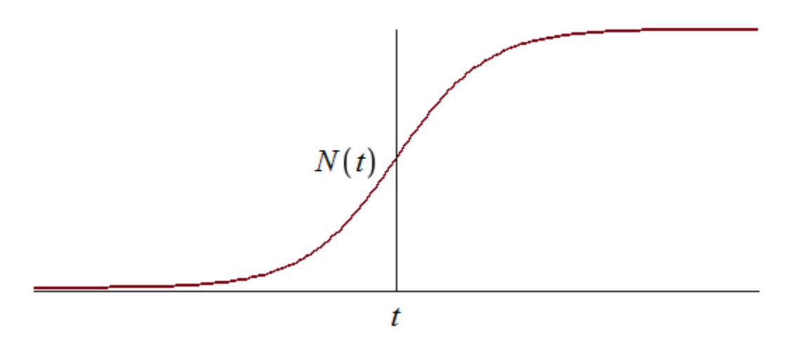
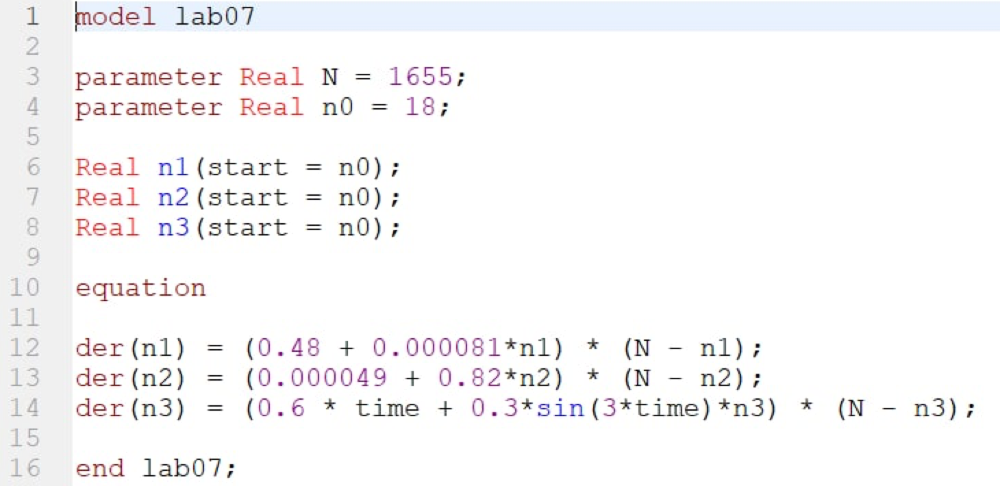
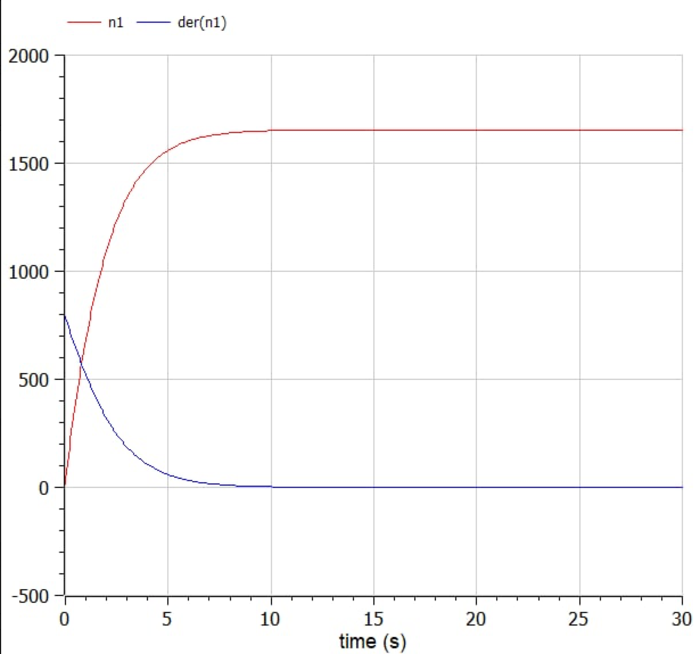
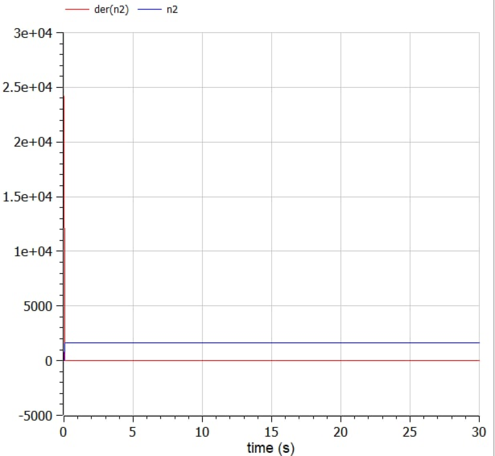
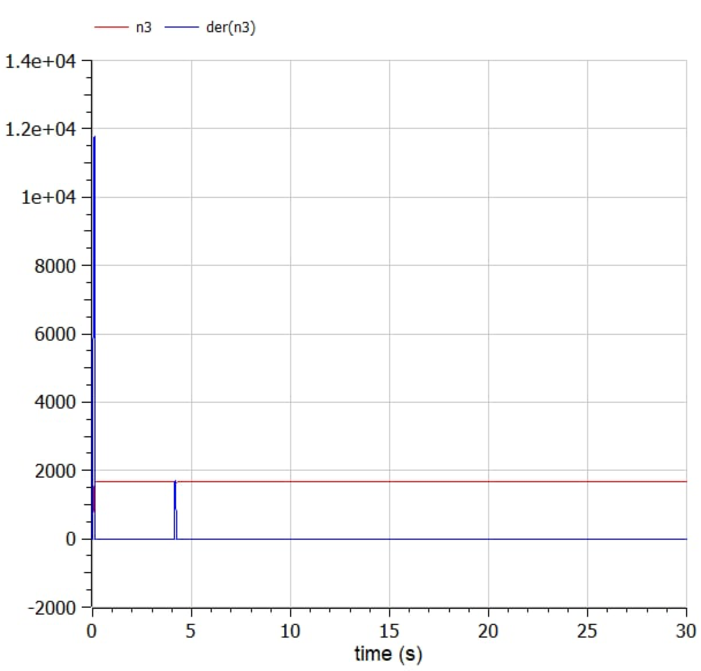
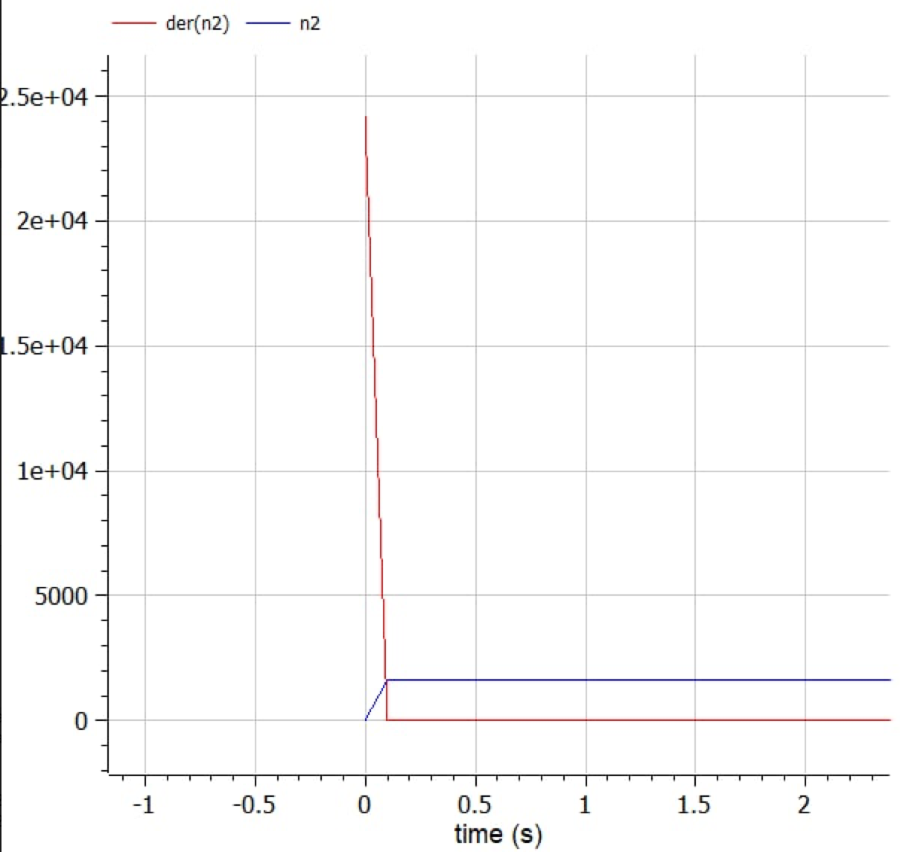

---
# Front matter
title: "Лабораторная работа №7. Эффективность рекламы"
subtitle: "Вариант 28"
author: "Смородова Дарья Владимировна"
group: NFIbd-03-19
institute: RUDN University, Moscow, Russian Federation
date: 2022 March 26th

# Generic otions
lang: ru-RU
toc-title: "Содержание"

# Bibliography
bibliography: bib/cite.bib
csl: pandoc/csl/gost-r-7-0-5-2008-numeric.csl

# Pdf output format
toc: true # Table of contents
toc_depth: 2
lof: true # List of figures
lot: true # List of tables
fontsize: 12pt
linestretch: 1.5
papersize: a4
documentclass: scrreprt
## I18n
polyglossia-lang:
  name: russian
  options:
	- spelling=modern
	- babelshorthands=true
polyglossia-otherlangs:
  name: english
### Fonts
mainfont: PT Serif
romanfont: PT Serif
sansfont: PT Sans
monofont: PT Mono
mainfontoptions: Ligatures=TeX
romanfontoptions: Ligatures=TeX
sansfontoptions: Ligatures=TeX,Scale=MatchLowercase
monofontoptions: Scale=MatchLowercase,Scale=0.9
## Biblatex
biblatex: true
biblio-style: "gost-numeric"
biblatexoptions:
  - parentracker=true
  - backend=biber
  - hyperref=auto
  - language=auto
  - autolang=other*
  - citestyle=gost-numeric
## Misc options
indent: true
header-includes:
  - \linepenalty=10 # the penalty added to the badness of each line within a paragraph (no associated penalty node) Increasing the value makes tex try to have fewer lines in the paragraph.
  - \interlinepenalty=0 # value of the penalty (node) added after each line of a paragraph.
  - \hyphenpenalty=50 # the penalty for line breaking at an automatically inserted hyphen
  - \exhyphenpenalty=50 # the penalty for line breaking at an explicit hyphen
  - \binoppenalty=700 # the penalty for breaking a line at a binary operator
  - \relpenalty=500 # the penalty for breaking a line at a relation
  - \clubpenalty=150 # extra penalty for breaking after first line of a paragraph
  - \widowpenalty=150 # extra penalty for breaking before last line of a paragraph
  - \displaywidowpenalty=50 # extra penalty for breaking before last line before a display math
  - \brokenpenalty=100 # extra penalty for page breaking after a hyphenated line
  - \predisplaypenalty=10000 # penalty for breaking before a display
  - \postdisplaypenalty=0 # penalty for breaking after a display
  - \floatingpenalty = 20000 # penalty for splitting an insertion (can only be split footnote in standard LaTeX)
  - \raggedbottom # or \flushbottom
  - \usepackage{float} # keep figures where there are in the text
  - \floatplacement{figure}{H} # keep figures where there are in the text
---

# Цель работы

Целью данной лабораторной работы является изучение задачи об эффективности рекламы, написание кода и построение графика распространения рекламы в трёх случаях, а также определение для второго случая, в какой момент времени скорость распространения рекламы будет иметь максимальное значение.

# Задание

Постройте график распространения рекламы, математическая модель которой описывается следующим уравнением:

1. $\dfrac{dn}{dt} = (0.48 + 0.000081n(t))(N - n(t))$
2. $\dfrac{dn}{dt} = (0.000049 + 0.82n(t))(N - n(t))$
3. $\dfrac{dn}{dt} = (0.6t + 0.3sin(3t)n(t))(N - n(t))$

При этом объем аудитории $N = 1655$, в начальный момент о товаре знает 18 человек. Для случая 2 определите, в какой момент времени скорость распространения рекламы будет иметь максимальное значение.

# Теоретическое введение

Организуется рекламная кампания нового товара или услуги. Необходимо,
чтобы прибыль будущих продаж с избытком покрывала издержки на рекламу.
Вначале расходы могут превышать прибыль, поскольку лишь малая часть
потенциальных покупателей будет информирована о новинке. Затем, при
увеличении числа продаж, возрастает и прибыль, и, наконец, наступит момент, когда рынок насытиться, и рекламировать товар станет бесполезным. [^1]

Предположим, что торговыми учреждениями реализуется некоторая
продукция, о которой в момент времени $t$ из числа потенциальных покупателей $N$ знает лишь $n$ покупателей. Для ускорения сбыта продукции запускается реклама по радио, телевидению и других средств массовой информации. После запуска рекламной кампании информация о продукции начнет распространяться среди потенциальных покупателей путем общения друг с другом. Таким образом, после запуска рекламных объявлений скорость изменения числа знающих о продукции людей пропорциональна как числу знающих о товаре покупателей, так и числу покупателей о нем не знающих.

Модель рекламной кампании описывается следующими величинами.
Считаем, что $dn/dt$ - скорость изменения со временем числа потребителей, узнавших о товаре и готовых его купить, $t$ - время, прошедшее с начала рекламной кампании, $n(t)$ - число уже информированных клиентов. Эта величина пропорциональна числу покупателей, еще не знающих о нем, это описывается следующим образом: $\alpha_1(t)(N-n(t))$, где $N$ - общее число потенциальных
платежеспособных покупателей, $\alpha_1(t)>0$ - характеризует интенсивность рекламной кампании (зависит от затрат на рекламу в данный момент времени). Помимо этого, узнавшие о товаре потребители также распространяют полученную информацию среди потенциальных покупателей, не знающих о нем (в этом случае работает сарафанное радио). Этот вклад в рекламу описывается величиной $\alpha_2(t)n(t)(N-n(t))$, эта величина увеличивается с увеличением потребителей узнавших о товаре. Математическая модель распространения рекламы описывается уравнением (1): 

$$dn/dt = (\alpha_1(t) + \alpha_2(t)n(t))(N-n(t)))$$

При $\alpha_1(t) \gg \alpha_2(t)$ получается модель типа модели Мальтуса, решение которой имеет вид (рис.[-@fig:001]):

{ #fig:001 width=90% }

В обратном случае, при $\alpha_1(t) \ll \alpha_2(t)$ получаем уравнение логистической кривой (рис.[-@fig:002]):

{ #fig:002 width=90% }

# Выполнение лабораторной работы

1. Выполнять данную лабораторную работу я буду в программе OpenModelica.

2. Напишем программу для построения графиков распространения рекламы (рис.[-@fig:003]): 

{ #fig:003 width=90% }

3. Получим график распространения рекламы для первого случая (рис.[-@fig:004]):

{ #fig:004 width=90% }

4. Получим график распространения рекламы для второго случая (рис.[-@fig:005]):

{ #fig:005 width=90% }

5. Получим график распространения рекламы для третьего случая (рис.[-@fig:006]):

{ #fig:006 width=90% }

6. Получим график изменения скорости распространения рекламы для второго случая (рис.[-@fig:007]):

{ #fig:007 width=90% }

По графику видно, что значение графика производной максимально в начальный момент времени $t0 = 0$.

# Выводы  

В ходе данной лабораторной работы, мы изучили задачу об эффективности рекламы, написали код и построили графики распространения рекламы для трёх случаев, а также определили для второго случая, в какой момент времени скорость распространения рекламы будет иметь максимальное значение.

# Список литературы

1. [Кулябов Д.С. Эффективность рекламы / Д. С. Кулябов. - Москва: - 7 с.](https://esystem.rudn.ru/pluginfile.php/1343901/mod_resource/content/2/%D0%9B%D0%B0%D0%B1%D0%BE%D1%80%D0%B0%D1%82%D0%BE%D1%80%D0%BD%D0%B0%D1%8F%20%D1%80%D0%B0%D0%B1%D0%BE%D1%82%D0%B0%20%E2%84%96%206.pdf)

[^1]: Кулябов Д.С. Эффективность рекламы.