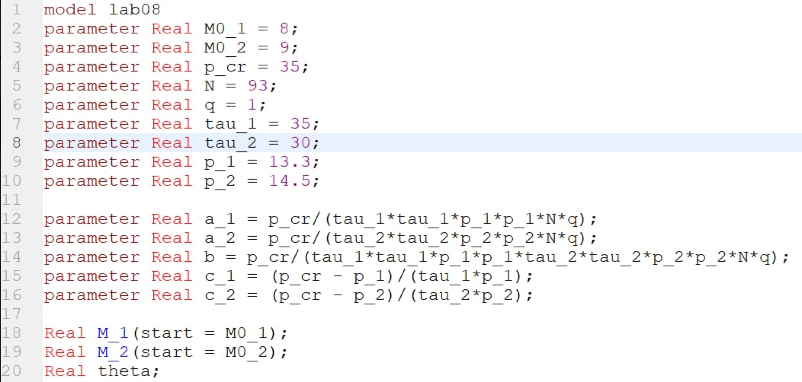
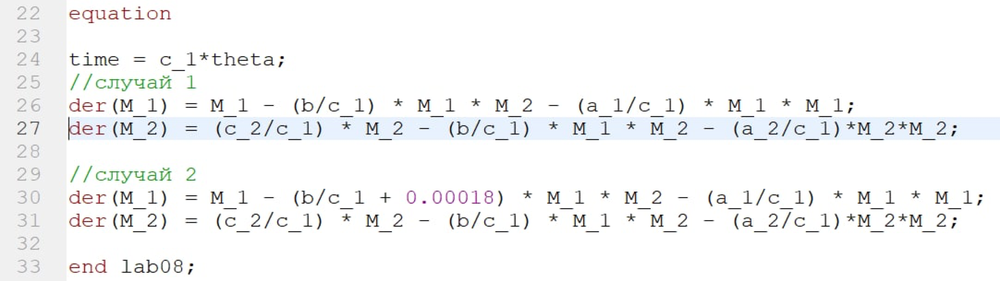
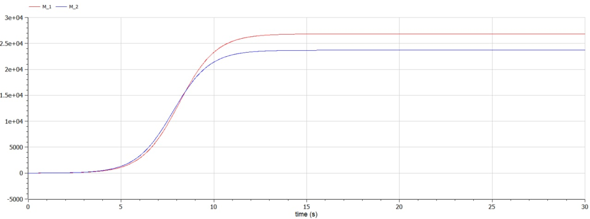
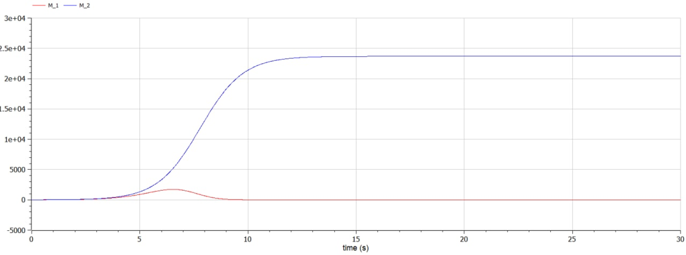

---
# Front matter
lang: ru-RU
title: Защита лабораторной работы №8. Модель конкуренции двух фирм
author: "Смородова Дарья Владимировна"
group: NFIbd-03-19
institute: RUDN University, Moscow, Russian Federation
date: 2022 April 2nd

# Formatting
toc: false
slide_level: 2
theme: metropolis
header-includes:
  - \metroset{progressbar=frametitle,sectionpage=progressbar,numbering=fraction}
  - '\makeatletter'
  - '\beamer@ignorenonframefalse'
  - '\makeatother' 
aspectratio: 43 
section-titles: true
---

# Цель выполнения лабораторной работы

1. изучить модель конкуренции двух фирм для двух случаев без учета социально-психологического фактора и с учетом социально-психологического фактора;

2. Научиться строить графики для этих двух случаев.

# Задание лабораторной работы

## Вариант 28

1. Постройте графики изменения оборотных средств фирмы 1 и фирмы 2 без
учета постоянных издержек и с веденной нормировкой для случая 1.

2. Постройте графики изменения оборотных средств фирмы 1 и фирмы 2 без
учета постоянных издержек и с веденной нормировкой для случая 2.

# Теоретические данные  

## Обозначения

- $N$ – число потребителей производимого продукта;  
- $\tau$ – длительность производственного цикла;  
- $p$ – рыночная цена товара;  
- $\widetilde{p}$ – себестоимость продукта, то есть переменные издержки на производство единицы продукции;  
- $q$ – максимальная потребность одного человека в продукте в единицу времени.  
- $\theta = \frac{t}{c_1}$ - безразмерное время

## Случай 1

Рассмотрим две фирмы, производящие взаимозаменяемые товары одинакового качества и находящиеся в одной рыночной нише. Считаем, что в рамках нашей модели конкурентная борьба ведётся только рыночными методами. То есть, конкуренты могут влиять на противника путем изменения параметров своего производства: себестоимость, время цикла, но не могут прямо вмешиваться в ситуацию на рынке («назначать» цену или влиять на потребителей каким-либо иным способом.) Будем считать, что постоянные издержки пренебрежимо малы, и в модели учитывать не будем. В этом случае динамика изменения объемов продаж фирмы 1 и фирмы 2 описывается следующей системой уравнений:

## Уравнения для случая 1

$$\frac{dM_1}{d\theta} = M_1 - \frac{b}{c_1} M_1 M_2 - \frac{a_1}{c_1} M_1^2$$  

$$\frac{dM_2}{d\theta} = \frac{c_2}{c_1} M_2 - \frac{b}{c_1} M_1 M_2-\frac{a_2}{c_1} M_2^2$$ 

## Случай 1

$$a_1 =\frac{p_{cr}}{\tau_1^2\widetilde{p_1}^2Nq},$$  

$$a_2=\frac{p_{cr}}{\tau_2^2\widetilde{p_2}^2Nq},$$  

$$b=\frac{p_{cr}}{\tau_1^2\widetilde{p_1}^2\tau_2^2\widetilde{p_2}^2Nq},$$  

$$c_1=\frac{p_{cr} - \widetilde{p_1}}{\tau_1\widetilde{p_1}},$$  

$$c_2=\frac{p_{cr} - \widetilde{p_2}}{\tau_2\widetilde{p_2}},$$  

Также введена нормировка $t = c_1 \theta$.

## Случай 2

Рассмотрим модель, когда, помимо экономического фактора влияния (изменение себестоимости, производственного цикла использование кредита и т.п.), используются еще и социально-психологические факторы – формирование общественного предпочтения одного товара другому, не зависимо от их качества и цены. В этом случае взаимодействие двух фирм будет зависеть друг от друга, соответственно коэффициент перед $M_1 M_2$ будет отличаться. Пусть в рамках рассматриваемой модели динамика изменения объемов продаж фирмы 1 и фирмы 2 описывается следующей системой уравнений:

## Уравнения для случая 2

$$\frac{dM_1}{d\theta} = M_1 - (\frac{b}{c_1} + 0,00018) M_1 M_2 - \frac{a_1}{c_1} M_1^2$$

$$\frac{dM_2}{d\theta} = \frac{c_2}{c_1} M_2 - \frac{b}{c_1} M_1 M_2-\frac{a_2}{c_1} M_2^2$$ 

## Начальнные условия

Для обоих случаев рассмотрим задачу со следующими начальными условиями и $M_0^1 = 8, M_0^2 = 9, p_{cr} = 35, N = 93, q = 1$

параметрами: $\tau_1 = 35, \tau_2 = 30, \widetilde{p_1} = 13.3, \widetilde{p_2} = 14.5$

# Результаты выполнения лабораторной работы

## Код программы с заданием всех начальных условий

## Код программы с записью дифференциальных уравнений для двух случаев

## График для первого случая

## График для второго случая

# Выводы

1. Изучили модель конкуренции двух фирм;

2. Научились строить модель конкуренции двух фирм для двух случаев без учета социально-психологического фактора и с учетом социально-психологического фактора;

3. Написали код и построили эти графики. 
