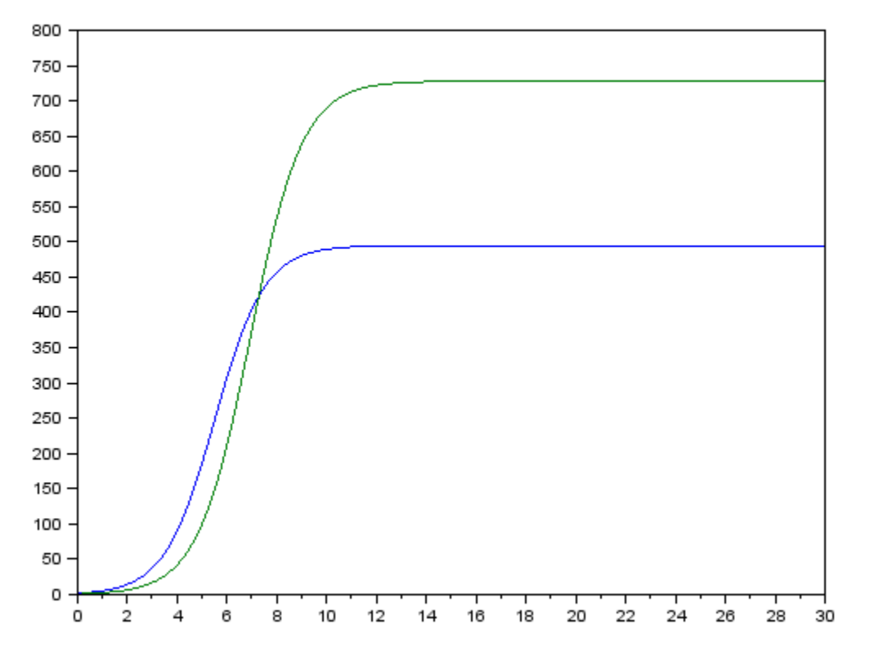
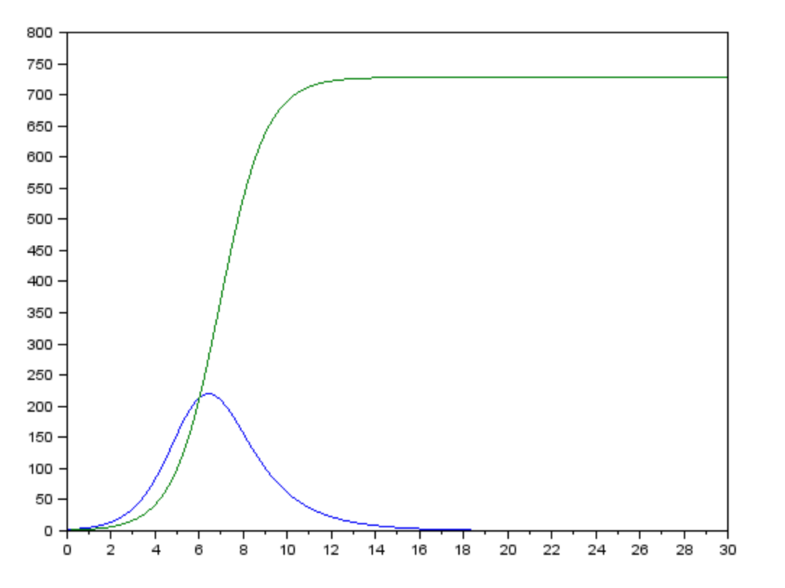
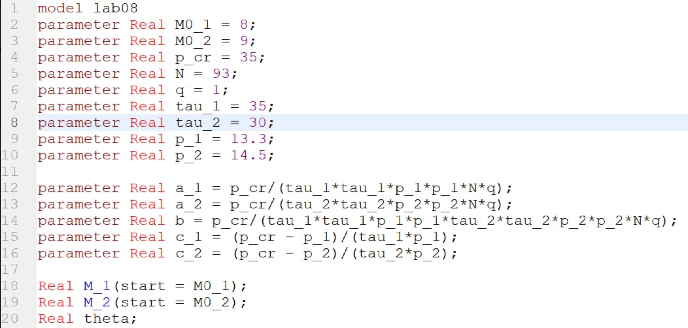
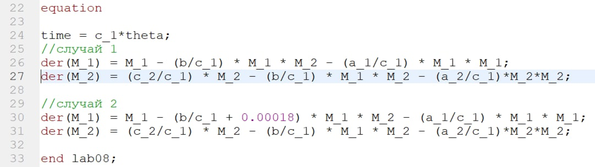
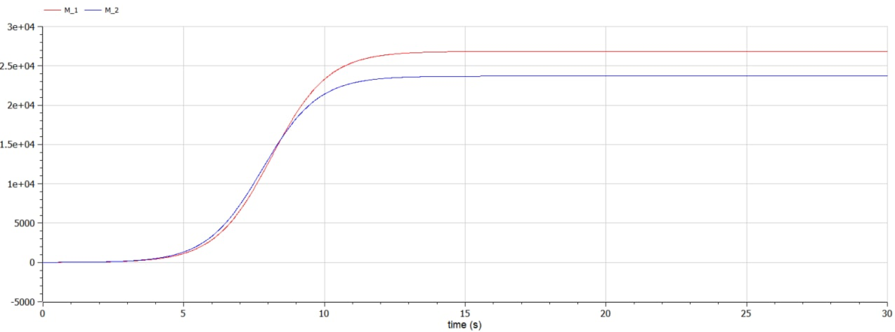
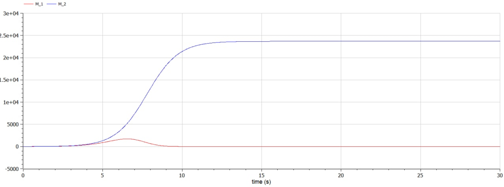

---
# Front matter
title: "Лабораторная работа №8. Модель конкуренции двух фирм"
subtitle: "Вариант 28"
author: "Смородова Дарья Владимировна"
group: NFIbd-03-19
institute: RUDN University, Moscow, Russian Federation
date: 2022 April 2nd

# Generic otions
lang: ru-RU
toc-title: "Содержание"

# Bibliography
bibliography: bib/cite.bib
csl: pandoc/csl/gost-r-7-0-5-2008-numeric.csl

# Pdf output format
toc: true # Table of contents
toc_depth: 2
lof: true # List of figures
lot: true # List of tables
fontsize: 12pt
linestretch: 1.5
papersize: a4
documentclass: scrreprt
## I18n
polyglossia-lang:
  name: russian
  options:
	- spelling=modern
	- babelshorthands=true
polyglossia-otherlangs:
  name: english
### Fonts
mainfont: PT Serif
romanfont: PT Serif
sansfont: PT Sans
monofont: PT Mono
mainfontoptions: Ligatures=TeX
romanfontoptions: Ligatures=TeX
sansfontoptions: Ligatures=TeX,Scale=MatchLowercase
monofontoptions: Scale=MatchLowercase,Scale=0.9
## Biblatex
biblatex: true
biblio-style: "gost-numeric"
biblatexoptions:
  - parentracker=true
  - backend=biber
  - hyperref=auto
  - language=auto
  - autolang=other*
  - citestyle=gost-numeric
## Misc options
indent: true
header-includes:
  - \linepenalty=10 # the penalty added to the badness of each line within a paragraph (no associated penalty node) Increasing the value makes tex try to have fewer lines in the paragraph.
  - \interlinepenalty=0 # value of the penalty (node) added after each line of a paragraph.
  - \hyphenpenalty=50 # the penalty for line breaking at an automatically inserted hyphen
  - \exhyphenpenalty=50 # the penalty for line breaking at an explicit hyphen
  - \binoppenalty=700 # the penalty for breaking a line at a binary operator
  - \relpenalty=500 # the penalty for breaking a line at a relation
  - \clubpenalty=150 # extra penalty for breaking after first line of a paragraph
  - \widowpenalty=150 # extra penalty for breaking before last line of a paragraph
  - \displaywidowpenalty=50 # extra penalty for breaking before last line before a display math
  - \brokenpenalty=100 # extra penalty for page breaking after a hyphenated line
  - \predisplaypenalty=10000 # penalty for breaking before a display
  - \postdisplaypenalty=0 # penalty for breaking after a display
  - \floatingpenalty = 20000 # penalty for splitting an insertion (can only be split footnote in standard LaTeX)
  - \raggedbottom # or \flushbottom
  - \usepackage{float} # keep figures where there are in the text
  - \floatplacement{figure}{H} # keep figures where there are in the text
---

# Цель работы

Целью данной лабораторной работы является изучить модель конкуренции двух фирм для двух случаев без учета социально-психологического фактора и с учетом социально-психологического фактора и научиться строить графики для этих двух случаев.

# Задание

**Случай 1.** Рассмотрим две фирмы, производящие взаимозаменяемые товары одинакового качества и находящиеся в одной рыночной нише. Считаем, что в рамках нашей модели конкурентная борьба ведётся только рыночными методами. То есть, конкуренты могут влиять на противника путем изменения параметров своего производства: себестоимость, время цикла, но не могут прямо вмешиваться в ситуацию на рынке («назначать» цену или влиять на потребителей каким-либо иным способом.) Будем считать, что постоянные издержки пренебрежимо малы, и в модели учитывать не будем. В этом случае динамика изменения объемов продаж фирмы 1 и фирмы 2 описывается следующей системой уравнений:

$$\frac{dM_1}{d\theta} = M_1 - \frac{b}{c_1} M_1 M_2 - \frac{a_1}{c_1} M_1^2$$  

$$\frac{dM_2}{d\theta} = \frac{c_2}{c_1} M_2 - \frac{b}{c_1} M_1 M_2-\frac{a_2}{c_1} M_2^2$$ 

где

$$a_1 =\frac{p_{cr}}{\tau_1^2\widetilde{p_1}^2Nq},$$  

$$a_2=\frac{p_{cr}}{\tau_2^2\widetilde{p_2}^2Nq},$$  

$$b=\frac{p_{cr}}{\tau_1^2\widetilde{p_1}^2\tau_2^2\widetilde{p_2}^2Nq},$$  

$$c_1=\frac{p_{cr} - \widetilde{p_1}}{\tau_1\widetilde{p_1}},$$  

$$c_2=\frac{p_{cr} - \widetilde{p_2}}{\tau_2\widetilde{p_2}},$$  

Также введена нормировка $t = c_1 \theta$.

**Случай 2.** Рассмотрим модель, когда, помимо экономического фактора влияния (изменение себестоимости, производственного цикла использование кредита и т.п.), используются еще и социально-психологические факторы – формирование общественного предпочтения одного товара другому, не зависимо от их качества и цены. В этом случае взаимодействие двух фирм будет зависеть друг от друга, соответственно коэффициент перед $M_1 M_2$ будет отличаться. Пусть в рамках рассматриваемой модели динамика изменения объемов продаж фирмы 1 и фирмы 2 описывается следующей системой уравнений:

$$\frac{dM_1}{d\theta} = M_1 - (\frac{b}{c_1} + 0,00018) M_1 M_2 - \frac{a_1}{c_1} M_1^2$$

$$\frac{dM_2}{d\theta} = \frac{c_2}{c_1} M_2 - \frac{b}{c_1} M_1 M_2-\frac{a_2}{c_1} M_2^2$$ 

Для обоих случаев рассмотрим задачу со следующими начальными условиями и $M_0^1 = 8, M_0^2 = 9, p_{cr} = 35, N = 93, q = 1$

параметрами: $\tau_1 = 35, \tau_2 = 30, \widetilde{p_1} = 13.3, \widetilde{p_2} = 14.5$

***Замечание:*** Значения $p_{cr}, \widetilde{p_{1,2}}, N$ указаны в тысячах единиц, а значения $M_{1,2}$ указаны в млн. единиц.

***Обозначения:***

- $N$ – число потребителей производимого продукта;  
- $\tau$ – длительность производственного цикла;  
- $p$ – рыночная цена товара;  
- $\widetilde{p}$ – себестоимость продукта, то есть переменные издержки на производство единицы продукции;  
- $q$ – максимальная потребность одного человека в продукте в единицу времени.  
- $\theta = \frac{t}{c_1}$ - безразмерное время

1. Постройте графики изменения оборотных средств фирмы 1 и фирмы 2 без
учета постоянных издержек и с веденной нормировкой для случая 1.

2. Постройте графики изменения оборотных средств фирмы 1 и фирмы 2 без
учета постоянных издержек и с веденной нормировкой для случая 2. [^2]

# Теоретическое введение

**Модель одной фирмы**
Для построения модели конкуренции хотя бы двух фирм необходимо
рассмотреть модель одной фирмы. Вначале рассмотрим модель фирмы,
производящей продукт долговременного пользования, когда цена его определяется балансом спроса и предложения. Примем, что этот продукт занимает определенную нишу рынка и конкуренты в ней отсутствуют.

Обозначим:
$N$ – число потребителей производимого продукта.

$S$ – доходы потребителей данного продукта. Считаем, что доходы всех
потребителей одинаковы. Это предположение справедливо, если речь идет об одной рыночной нише, т.е. производимый продукт ориентирован на определенный слой населения.

$M$ – оборотные средства предприятия.

$\tau$ – длительность производственного цикла.

$p$ – рыночная цена товара.

$\widetilde{p}$ – себестоимость продукта, то есть переменные издержки на производство
единицы продукции.

$\delta$ - доля оборотных средств, идущая на покрытие переменных издержек.

$k$ – постоянные издержки, которые не зависят от количества выпускаемой продукции.

$Q(S/p)$ – функция спроса, зависящая от отношения дохода S к цене p. Она равна количеству продукта, потребляемого одним потребителем в единицу времени.

Функцию спроса товаров долговременного использования часто
представляют в простейшей форме (1):

$$Q = q - k\frac{p}{S} = q(1-\frac{p}{p_{cr}})$$

где $q$ – максимальная потребность одного человека в продукте в единицу времени.
Эта функция падает с ростом цены и при $p=p_{cr}$ (критическая стоимость продукта)
потребители отказываются от приобретения товара. Величина $p_{cr} = Sq/k$. Параметр $k$ – мера эластичности функции спроса по цене. Таким образом, функция спроса в форме (1) является пороговой (то есть, $Q(S/p)=0$ при $p \ge p_{cr}$) и обладаетсвойствами насыщения.

Уравнения динамики оборотных средств можно записать в виде (2)

$$\frac {dM}{dt} = -\frac {M \delta}{\tau} + N Q p - k = -\frac {M \delta}{\tau} + N q (1- \frac {p}{p_{cr}})p-k$$

Уравнение для рыночной цены p представим в виде (3)

$$ \frac {dp}{dt} = \gamma (-\frac{M \delta}{\tau \widetilde{p}} +N q(1 - \frac{p}{p_{cr}}))$$

Первый член соответствует количеству поставляемого на рынок товара (то
есть, предложению), а второй член – спросу.

Параметр $\gamma$ зависит от скорости оборота товаров на рынке. Как правило, время торгового оборота существенно меньше времени производственного цикла $\tau$. При заданном M уравнение (3) описывает быстрое стремление цены к равновесному значению цены, которое устойчиво.

В этом случае уравнение (3) можно заменить алгебраическим соотношением (4)

$$-\frac{M\delta}{\tau \widetilde{p}} + N q(1 - \frac{p}{p_{cr}}) = 0$$

Из (4) следует, что равновесное значение цены p равно (5)

$$p = p-{cr}(1 - \frac {M \delta} {\tau \widetilde{p} N q})$$

Уравнение (2) с учетом (5) приобретает вид (6)

$$\frac {dM}{dt} = M \frac{\delta}{\tau}(\frac{p_{cr}}{\widetilde{p}}-1) - M^2(\frac{\delta}{\tau \widetilde{p}})^2 \frac{p_{cr}}{N q} - k$$

Уравнение (6) имеет два стационарных решения, соответствующих
условию $dM/dt=0$ (7):

$$\widetilde{M_{1,2}} = \frac{1}{2} a \pm \sqrt{\frac{a^2}{4}-b}$$

где (8)

$$a = Nq(1-\frac{\widetilde{p}}{p_{cr}})\widetilde{p} \frac{\tau}{\delta}, b = kNq\frac{(\tau \widetilde{p})^2}{p_{cr}\delta^2}$$

Из (7) следует, что при больших постоянных издержках (в случае $a^2<4b$) стационарных состояний нет. Это означает, что в этих условиях фирма не может функционировать стабильно, то есть, терпит банкротство. Однако, как правило, постоянные затраты малы по сравнению с переменными (то есть, $b \ll a^2$) и играют роль, только в случае, когда оборотные средства малы. При $b \ll a$ стационарные значения $M$ равны (9)

$$\widetilde{M}_+ = Nq\frac{\tau}{\delta} (1 - \frac{\widetilde{p}}{p_{cr}}\widetilde{p}), \widetilde{M}_- = k\widetilde{p} \frac{\tau}{\delta(p_{cr}-\widetilde{p})}$$

Первое состояние $\widetilde{M}_+$ устойчиво и соответствует стабильному функционированию предприятия. Второе состояние $\widetilde{M}_-$ неустойчиво, так, что при $M<\widetilde{M}_-$ оборотные средства падают ($dM/dt<0$), то есть, фирма идет к банкротству. По смыслу $\widetilde{M}_-$ соответствует начальному капиталу, необходимому для входа в рынок.

В обсуждаемой модели параметр $\delta$ всюду входит в сочетании с $\tau$ Это значит, что уменьшение доли оборотных средств, вкладываемых в производство, эквивалентно удлинению производственного цикла. Поэтому мы в дальнейшем положим: $\delta=1$, а параметр $\tau$ будем считать временем цикла, с учётом сказанного.

**Конкуренция двух фирм** 

**Случай 1**

Рассмотрим две фирмы, производящие взаимозаменяемые товары одинакового качества и находящиеся в одной рыночной нише. Последнее означает, что у потребителей в этой нише нет априорных предпочтений, и они приобретут тот или иной товар, не обращая внимания на знак фирмы. В этом случае, на рынке устанавливается единая цена, которая определяется балансом суммарного предложения и спроса. Иными словами, в рамках нашей модели конкурентная борьба ведётся только рыночными методами. То есть, конкуренты могут влиять на противника путем изменения параметров своего производства: себестоимость, время цикла, но не могут прямо вмешиваться в ситуацию на рынке («назначать» цену или влиять на потребителей каким- либо иным способом.)
Уравнения динамики оборотных средств запишем по аналогии с (2) в виде (10)

$$\frac{dM_1}{dt} = -\frac{M_1}{\tau_1} + N_1 q (1 - \frac{p}{p_{cr}})p-k_1$$

$$\frac{dM_2}{dt} = -\frac{M_2}{\tau_2} + N_2 q (1 - \frac{p}{p_{cr}})p-k_2$$

где использованы те же обозначения, а индексы 1 и 2 относятся к первой и второй фирме, соответственно. Величины $N_1$ и $N_2$ – числа потребителей, приобретших товар первой и второй фирмы.

Учтем, что товарный баланс устанавливается быстро, то есть, произведенный каждой фирмой товар не накапливается, а реализуется по цене $p$.
Тогда (11)

$$\frac{M_1}{\tau_1 \widetilde{p_1}} = N_1q(1 - \frac{p}{p_{cr}})$$

$$\frac{M_2}{\tau_2 \widetilde{p_2}} = N_2q(1 - \frac{p}{p_{cr}})$$

где $\widetilde{p}_1$ и $\widetilde{p}_2$ – себестоимости товаров в первой и второй фирме.

С учетом (10) представим (11) в виде (12)

$$\frac{dM_1}{dt} = -\frac{M_1}{\tau_1} (1 - \frac{p}{\widetilde{p_1}})-k_1$$

$$\frac{dM_2}{dt} = -\frac{M_2}{\tau_2} (1 - \frac{p}{\widetilde{p_2}})-k_2$$

Уравнение для цены, по аналогии с (3), (13)

$$\frac{dp}{dt} = -\gamma(\frac{M_1}{\tau_1 \widetilde{p_1}} + \frac{M_2}{\tau_2\widetilde{p_2}} - Nq(1 - \frac{p}{p_{cr}}))$$

Считая, как и выше, что ценовое равновесие устанавливается быстро,
получим (14):

$$p = p_{cr}(1 - \frac{1}{Nq}(\frac{M-1}{\tau_1 \widetilde{p_1}} +\frac{M_2}{\tau_2 \widetilde{p_2}}))$$

Подставив (14) в (12) имеем (15):

$$\frac{dM_1}{dt} = c_1M_1 - bM_1M_2 - a_1M_1^2 - k_1$$

$$\frac{dM_2}{dt} = c_2M_2 - bM_1M_2 - a_2M_2^2 - k_2$$

где (16)

$$a_1 =\frac{p_{cr}}{\tau_1^2\widetilde{p_1}^2Nq},$$  

$$a_2=\frac{p_{cr}}{\tau_2^2\widetilde{p_2}^2Nq},$$  

$$b=\frac{p_{cr}}{\tau_1^2\widetilde{p_1}^2\tau_2^2\widetilde{p_2}^2Nq},$$  

$$c_1=\frac{p_{cr} - \widetilde{p_1}}{\tau_1\widetilde{p_1}},$$  

$$c_2=\frac{p_{cr} - \widetilde{p_2}}{\tau_2\widetilde{p_2}}$$  

Исследуем систему (15) в случае, когда постоянные издержки $(k1, k2)$ пренебрежимо малы. И введем нормировку $t=c_1\theta$. Получим следующую систему (17):

$$\frac{dM_1}{d\theta} = M_1 - \frac{b}{c_1} M_1 M_2 - \frac{a_1}{c_1} M_1^2$$  

$$\frac{dM_2}{d\theta} = \frac{c_2}{c_1} M_2 - \frac{b}{c_1} M_1 M_2-\frac{a_2}{c_1} M_2^2$$ 

Чтобы решить систему (17) необходимо знать начальные условия. Зададим
начальные значения $M_0^1=2, M_0^2=1$ и известные параметры: $p_{cr}=20, \tau_1=10, \tau_2=16, \widetilde{p}_1=9, \widetilde{p}_2=7, N=10, q=1$.

Замечание: Необходимо учесть, что значения $p_{cr}, \widetilde{p}_{1,2}, N$ указаны в тысячах единиц (например N=10 - означает 10 000 потенциальных потребителей), а значения $M_{1,2}$ указаны в млн. единиц.

При таких условиях получаем следующие динамики изменения объемов продаж (рис. [-@fig:001]):

{ #fig:001 width=90% }

По графику видно, что рост оборотных средств предприятий идет независимо друг от друга. В математической модели (17) этот факт отражается в коэффициенте, стоящим перед членом $M_1M_2$: в рассматриваемой задаче он одинаковый в обоих уравнениях ($\dfrac{b}{c_1}$. Это было обозначено в условиях задачи.
Каждая фирма достигает свое максимальное значение объема продаж и остается на рынке с этим значением, то есть каждая фирма захватывает свою часть рынка потребителей, которая не изменяется.

**Случай 2**

Рассмотрим модель, когда, помимо экономического фактора влияния
(изменение себестоимости, производственного цикла, использование кредита и т.п.), используются еще и социально-психологические факторы – формирование общественного предпочтения одного товара другому, не зависимо от их качества и цены. В этом случае взаимодействие двух фирм будет зависеть друг от друга, соответственно коэффициент перед $M_1M_2$ будет отличаться.

Рассмотрим следующую модель (18):

$$\frac{dM_1}{d\theta} = M_1 - (\frac{b}{c_1} + 0,002) M_1 M_2 - \frac{a_1}{c_1} M_1^2$$

$$\frac{dM_2}{d\theta} = \frac{c_2}{c_1} M_2 - \frac{b}{c_1} M_1 M_2-\frac{a_2}{c_1} M_2^2$$ 

Начальные условия и известные параметры остаются прежними. В этом
случаем получим следующее решение (рис. [-@fig:002]):

{ #fig:002 width=90% }

По графику видно, что первая фирма, несмотря на начальный рост,
достигнув своего максимального объема продаж, начитает нести убытки и, в итоге, терпит банкротство. Динамика роста объемов оборотных средств второй фирмы остается без изменения: достигнув максимального значения, остается на этом уровне.

***Замечание:*** Стоит отметить, что рассматривается упрощенная модель, которая дает модельное решение. В реальности факторов, влияющих на динамику изменения оборотных средств предприятий, больше.[^1]

# Выполнение лабораторной работы

1. Выполнять данную лабораторную работу я буду в программе OpenModelica.

2. Напишем часть программы с заданием всех начальных условий (рис.[-@fig:003]): 

{ #fig:003 width=90% }

3. Напишем оставшуюся часть кода с записью дифференциальных уравнений для двух случаев (рис.[-@fig:004]): 

{ #fig:004 width=90% }

4. Построим график для первого случая (рис.[-@fig:005]): 

{ #fig:005 width=90% }

5. Построим график для второго случая (рис.[-@fig:006]): 

{ #fig:006 width=90% }

# Выводы  

В ходе данной лабораторнной работы, мы научились строить модель конкуренции двух фирм для двух случаев без учета социально-психологического фактора и с учетом социально-психологического фактора, а также написали код и построили эти графики. 

# Список литературы

1. [Кулябов Д.С. Модель конкуренции двух фирм](https://esystem.rudn.ru/pluginfile.php/1343905/mod_resource/content/2/%D0%9B%D0%B0%D0%B1%D0%BE%D1%80%D0%B0%D1%82%D0%BE%D1%80%D0%BD%D0%B0%D1%8F%20%D1%80%D0%B0%D0%B1%D0%BE%D1%82%D0%B0%20%E2%84%96%207.pdf)

2. [Кулябов Д. С. Задание к лабораторной работе №8](https://esystem.rudn.ru/pluginfile.php/1343906/mod_resource/content/2/%D0%97%D0%B0%D0%B4%D0%B0%D0%BD%D0%B8%D0%B5%20%D0%BA%20%D0%BB%D0%B0%D0%B1%D0%BE%D1%80%D0%B0%D1%82%D0%BE%D1%80%D0%BD%D0%BE%D0%B9%20%D1%80%D0%B0%D0%B1%D0%BE%D1%82%D0%B5%20%E2%84%96%207.pdf)

[^1]: Кулябов Д.С. Модель конкуренции двух фирм.

[^2]: Кулябов Д.С. Задание к лабораторной работе №8.